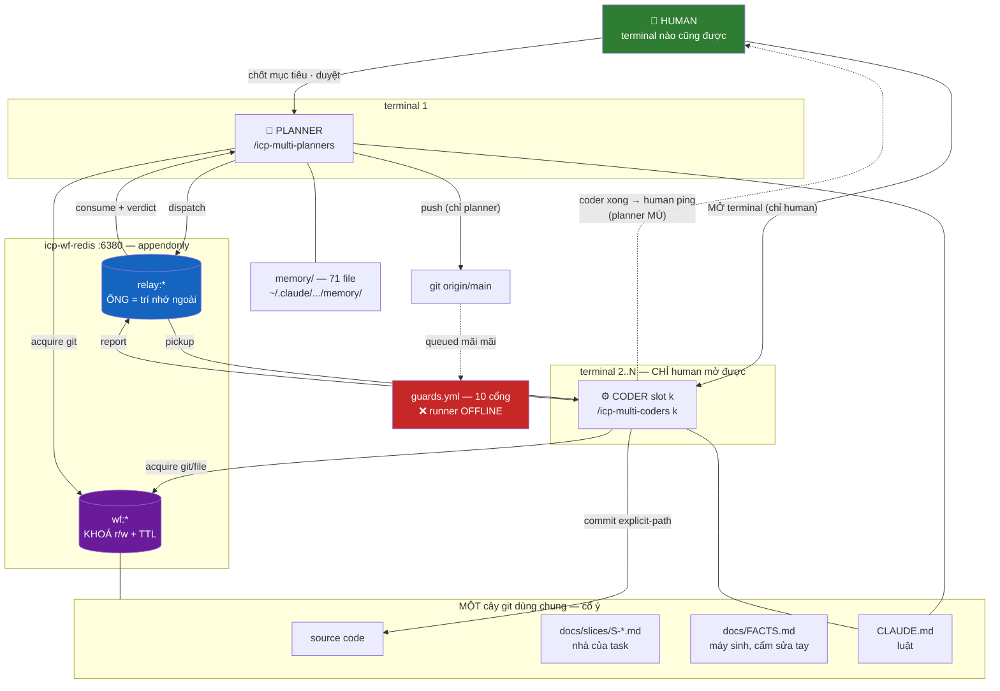
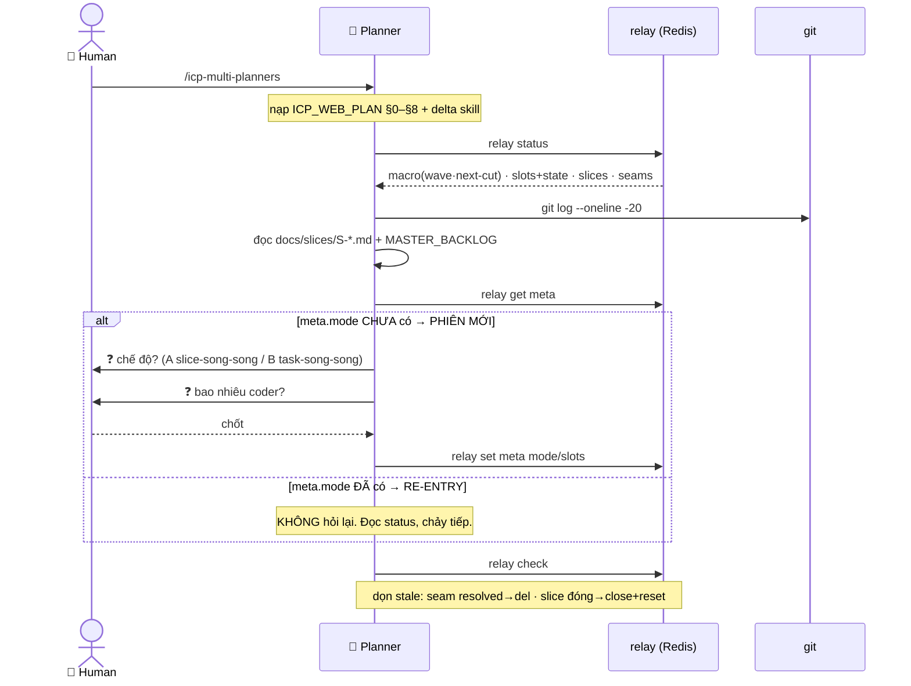
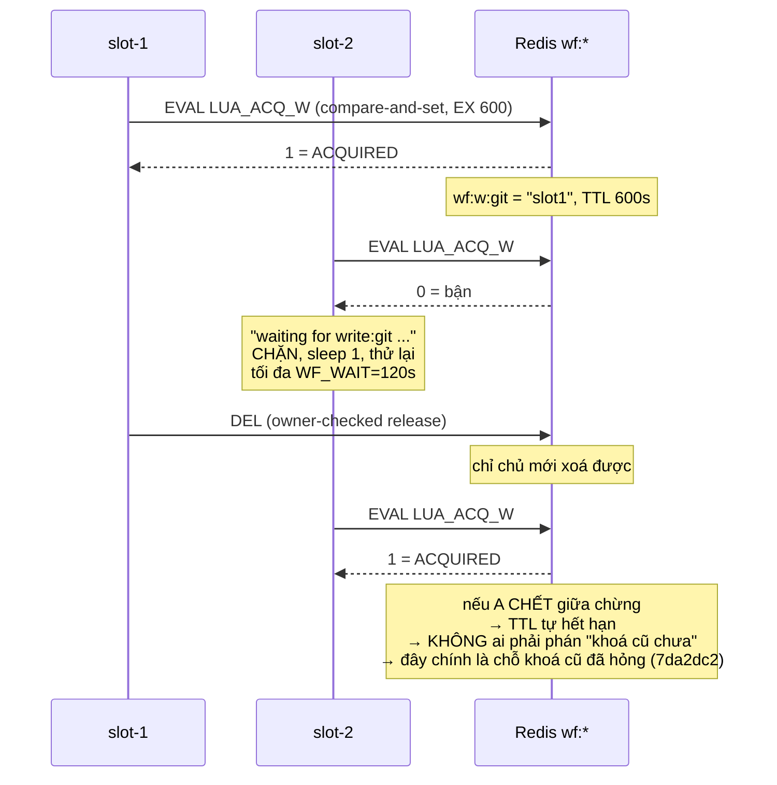
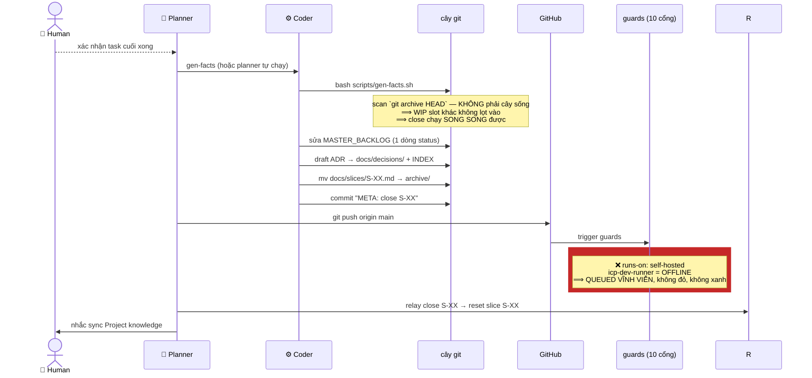
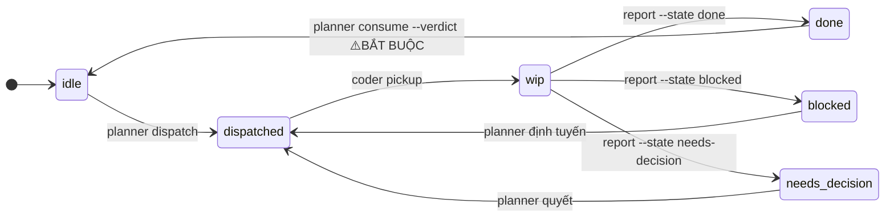

# CLAUDE WORKFLOW CỦA SICP — TOÀN ĐỒ

> **File này mô tả cỗ máy, KHÔNG phải luật.** Luật ở `CLAUDE.md`.
> Mọi khẳng định dưới đây đều kèm `path:dòng` hoặc lệnh tái lập. Cái nào tôi **đo**, tôi ghi số. Cái nào tôi **không đo được**, tôi ghi "chưa đo".
> Sinh ngày 2026-07-16 bằng cách **đọc hệ đang chạy**, không phải đọc doc cũ.

---

## §0. ĐỌC FILE NÀY ĐỂ LÀM GÌ

Trả lời đúng 3 câu:

1. **Claude workflow chạy ra sao?** → §5 (toàn đồ) + §7 (sequence đầy đủ)
2. **Nó dựa trên cái gì?** → §9 — và câu trả lời sẽ làm bạn khó chịu
3. **Bạn sai khiến nó thế nào?** → §8 (mặt điều khiển của bạn)

Kèm: §6 = **danh mục 100% file tham gia, không sót**, có dán nhãn SỐNG/CHẾT.

---

## §1. MÔ HÌNH 30 GIÂY

Bạn có **nhiều phiên Claude chạy song song trong nhiều terminal**. Chúng **không thấy nhau**, không nói chuyện được với nhau, và **mỗi phiên sẽ chết** (hết context / bạn thoát).

Vậy chúng phối hợp bằng cách nào? **Bằng cách ghi ra ngoài.** Toàn bộ workflow này chỉ là câu trả lời cho **một sự thật vật lý duy nhất**:

> **Context của Claude là hữu hạn, không chia sẻ, và sẽ chết.**

Mọi mảnh trong hệ đều là một phản ứng với sự thật đó:

| Mảnh | Nó chống lại cái gì |
|---|---|
| `scripts/relay` (Redis) | phiên chết → **trí nhớ chung nằm ngoài phiên** |
| `scripts/wf-lock` (Redis) | nhiều phiên **cùng ghi 1 cây git** → giẫm nhau |
| `CLAUDE.md` | phiên mới **không biết luật** → nạp lại mỗi lần |
| `docs/FACTS.md` + `gen-facts.sh` | doc **nói dối** về hiện trạng → sinh lại từ code thật |
| `docs/slices/S-*.md` | task **bay hơi** khi phiên chết → task có nhà trên đĩa |
| `memory/` (71 file) | bài học **mất** giữa các phiên |
| `.github/workflows/guards.yml` | Claude **tự khai** → máy kiểm hộ |
| `git` | tất cả những thứ trên **vẫn có thể mất** → git là kho cuối |

Đọc bảng đó theo chiều dọc là hiểu toàn bộ triết lý: **không có gì được phép chỉ tồn tại trong đầu một phiên Claude.**

---

## §2. BA VAI

| Vai | Chạy ở đâu | Được làm gì | KHÔNG được làm gì |
|---|---|---|---|
| **HUMAN (bạn)** | mọi terminal | quyết mục tiêu · duyệt thiết kế · **mở terminal coder** | — |
| **PLANNER** | 1 terminal, `/icp-multi-planners` | phân tích · cắt slice · dispatch · verify · consume · push | **không viết source** (`ICP_WEB_PLAN.md:8`) · không tự quyết kiến trúc |
| **CODER** | N terminal, `/icp-multi-coders <k>` | viết code · test · commit (khoá) · report | **không push** · không `clean`/`stash`/`reset --hard`/`rebase`/`merge` (`icp-multi-coders.md:17`) |

**Điều quan trọng nhất về bạn:** planner **không mở được terminal coder**. Chỉ bạn mở được. Nên planner phải **báo bạn slot nào chạy được** — đó là lý do có khối `▶ RUNNABLE` và tiếng chuông. Nếu planner quên báo, **bạn ngồi chờ mà không biết mình đang chờ gì**.

**Điều quan trọng thứ hai:** planner **mù**. Nó chỉ biết trạng thái khi nó **chạy lệnh `relay`**. Coder report xong → planner **không hề hay biết** cho tới lần poll kế. Không có tín hiệu đẩy. Bạn chính là bus sự kiện: **coder xong → bạn ping planner**.

---

## §3. HẠ TẦNG — 1 REDIS, 2 NAMESPACE

Cả workflow chạy trên **đúng 1 container**:

```
infra/docker-compose.workflow.yml  →  icp-wf-redis   (redis:7-alpine, host :6380)
```

Tách hẳn khỏi `icp-redis:6379` của sản phẩm — để điều phối workflow **không bao giờ tranh** với runtime (`docker-compose.workflow.yml:2-5`).

Trong đó có **2 namespace không dính nhau**:

| Namespace | Chủ | Dùng làm gì |
|---|---|---|
| `relay:*` | `scripts/relay` | **ống** — trí nhớ ngoài của planner |
| `wf:*` | `scripts/wf-lock` | **khoá** — chống giẫm chân |

`relay reset all` chỉ xoá `relay:*`, **không đụng `wf:*`** (`relay:101`). Cố ý.

**Tự bật:** cả `relay` lẫn `wf-lock` tự `docker compose up -d` nếu Redis chưa chạy (`wf-lock:87-99`). Bạn không phải nhớ bật.

**Bền:** `appendonly yes` → khoá và ống sống qua restart (`docker-compose.workflow.yml:16-17`).

---

## §4. HAI CƠ CHẾ CỐT LÕI

### 4.1 ỐNG (`scripts/relay`) — trí nhớ NGOÀI

Nguyên tắc tự nó tuyên bố (`relay:5-10`):

1. **Ống = bộ nhớ NGOÀI của planner: re-entry đọc là hiểu đầy đủ + rẻ.** ← đây là *lý do tồn tại*
2. **1-fact-1-nhà** — không copy; suy thay vì lưu 2 lần
3. **state-enum** — mỗi thực thể 1 field enum, `HGET` là biết liền
4. **atomic-partial-update** — mọi update = 1 HSET / 1 Lua, **không đọc-sửa-ghi**
5. **prefix-naming** — reset = xoá theo pattern

**Vì sao atomic quan trọng:** N coder + 1 planner ghi **cùng lúc**. Mỗi lệnh `relay` là **1 script Lua nguyên tử** (`relay:62,68,74,82,90`). Nên **ống không cần khoá** — coder ghi `slot:<k>` của nó, planner ghi macro/slice/seam. Khác key, không tranh.

### 4.2 KHOÁ (`scripts/wf-lock`) — chống giẫm chân

**Quyết định nền, và nó là CỐ Ý** (`wf-lock:6-15`):

> N coder + 1 planner làm việc trong **ĐÚNG MỘT CÂY GIT DÙNG CHUNG**.

Không phải hạn chế — là **chọn**. Một cây = một trunk tuyến tính, luôn hiện tại, luôn nhìn thấy được. **Divergence và merge-drift trở thành bất khả thi về mặt cấu trúc.**

**Đã BÁC, cấm tái tranh luận** (`wf-lock:33-46`):
- **branch/worktree mỗi slot rồi merge** — bác **không phải** vì "merge phức tạp", mà vì: (1) merge là **văn bản, không phải ngữ nghĩa** — A đổi tên `foo→bar`, B (file khác) vẫn gọi `foo()` → git merge **SẠCH**, code **HỎNG**; (2) branch **giấu** thay đổi; (3) divergence = agent làm trên **state cũ**.
- **chỉ planner được commit** — giết được ô nhiễm nhưng **không tách nổi 1 file 2 slot cùng sửa**, và biến planner thành nút cổ chai.

**Giá phải trả của cây chung** = tai nạn tranh chấp, và `wf-lock` quản đúng cái đó:

| Tai nạn | Thật đã xảy ra |
|---|---|
| commit không pathspec quét luôn file staged của slot khác | **sự cố `7da2dc2` có thật** (`wf-lock:10-11`) |
| `gen-facts` chụp nhầm WIP của slot khác | → sửa: scan `git archive HEAD` (`gen-facts.sh:10-20`) |
| `git clean`/`stash`/`checkout` xoá việc slot khác | → CẤM tuyệt đối với coder |
| 2 slot phá cùng 1 file | → `wf-lock acquire file:<path>` |

**Khoá cũ đã CHẾT vì sao:** `mkdir .pipe.lock`, không TTL, "cũ >10 phút thì cướp" thủ công → **một coder phán khoá còn sống là cũ, cướp, commit → `7da2dc2`** (`wf-lock:17-19`). Gốc lỗi = **khoá không tin được + cướp thủ công**, KHÔNG phải "coder được commit".

**Thiết kế hiện tại:**
- Redis → compare-and-set nguyên tử + **TTL tự hết hạn** (*không ai phải phán khoá cũ hay mới*) + kiểm chủ khi nhả + **hàng đợi CHẶN, không bao giờ CƯỚP**
- **Reader/Writer**: nhiều đọc HOẶC một ghi
- **ĐỒNG NHẤT**: mọi ghi đều lấy write-lock — file riêng đối xử **y hệt** file chung. **Không có danh sách "file dùng chung" nào để mà lệch.** Không tranh chấp = tức thì.
- **Section NGẮN, xong trong 1 lần invoke — KHÔNG BAO GIỜ giữ khoá qua exit/nghỉ** (`wf-lock:31-32`)

**Rủi ro đã chấp nhận, ghi thẳng ra** (`wf-lock:49-52`): **khoá là advisory** — Redis **không thể** chặn coder *quên* khoá. Phòng thủ nhiều lớp: helper này là đường **duy nhất** được phép + commit explicit-path (lớp 2) + (tương lai) pre-commit hook.

---

## §5. TOÀN ĐỒ



---

## §6. DANH MỤC FILE — 100%, KHÔNG SÓT

Quét 2 chiều: file mà workflow **trỏ tới**, và file **trỏ ngược** vào workflow (`grep -rl 'scripts/relay|scripts/wf-lock|icp-wf-redis|docker-compose.workflow'`).

### A. LUẬT — thứ Claude nạp vào đầu mỗi phiên

| File | Dòng | Vai trò | Ai đọc | Trạng thái |
|---|---|---|---|---|
| `CLAUDE.md` | 209 | **Luật gốc.** "File này LÀ luật. Không có file nào cao hơn nó." | planner + coder, **trước MỌI task** | 🟢 SỐNG |
| `docs/ICP_WEB_PLAN.md` | 69 | Luật vai PLAN (§0–§8). §8 = phân tích slice typed+tier | planner | 🟢 SỐNG |
| `docs/ICP_WORKFLOW_V2_WORKING.md` | — | Role-table gốc (`ICP_WEB_PLAN.md:5` trỏ vào) | tham chiếu | 🟡 trỏ-tới, ít đọc |
| `docs/ICP_PLAYBOOK_V2.2.md` | — | Nguồn taxonomy commit (`guards.yml:88`) | tham chiếu | 🟡 trỏ-tới |

### B. LỆNH GỌI — 4 slash command đang cài

| File | Gọi bằng | Trạng thái |
|---|---|---|
| `.claude/commands/icp-multi-planners.md` | `/icp-multi-planners` | 🟢 **SỐNG** — 25 KB |
| `.claude/commands/icp-multi-coders.md` | `/icp-multi-coders <k>` | 🟢 **SỐNG** — 10.6 KB |
| `.claude/commands/icp-claude-planner.md` | `/icp-claude-planner` | 🔴 **CHẾT** |
| `.claude/commands/icp-claude-coder.md` | `/icp-claude-coder` | 🔴 **CHẾT** |
| `.claude/settings.local.json` | — | 🟢 allowlist quyền (`relay get/show/pickup`, `cat`) |

> **🔴 Vì sao 2 cái kia chết:** cả hai bảo *"ON-INVOCATION: đọc ngay `./connecting-coder-and-planner.md`"* (`icp-claude-planner.md:6`, `icp-claude-coder.md:3`). **File đó không tồn tại** — `ls` xác nhận. Theo đúng protocol của chính chúng (`icp-claude-coder.md:4`): *"Trống/không tồn tại → 'Ống trống, chờ Planner.' DỪNG."*
> ⟹ Gọi chúng = **im lặng dừng**. Không báo lỗi. Chúng vẫn nằm trong menu slash command của bạn.

### C. MÁY MÓC — ống, khoá, hạ tầng

| File | Dòng | Vai trò |
|---|---|---|
| `scripts/relay` | 168 | **ỐNG.** open·dispatch·pickup·report·consume·status·show·check·runnable·close·reset |
| `scripts/wf-lock` | 154 | **KHOÁ.** with·with-read·acquire·release·renew·check·ls·status |
| `infra/docker-compose.workflow.yml` | 32 | `icp-wf-redis` :6380 |

### D. MÁY SINH SỰ THẬT

| File | Sinh ra | Luật |
|---|---|---|
| `scripts/gen-facts.sh` | `docs/FACTS.md` | **CẤM SỬA FACTS.md TAY** (`gen-facts.sh:2`) |
| `scripts/gen-parity.sh` + `scripts/gen_parity.py` | `docs/PARITY.md` | BE route ↔ FE consumer |
| `docs/parity-registry.json` | — | đăng ký W-FE |

### E. CỔNG — nơi máy kiểm hộ Claude

| File | Nội dung | Trạng thái |
|---|---|---|
| `.github/workflows/guards.yml` | **10 job**: tenant-route · runtime-role · migration-rollback · cutover-migrations · **facts-drift** · **commit-lint** · openapi-drift · svc-openapi-drift · ai-openapi-drift · parity-ledger | 🔴 **`active` nhưng runner OFFLINE → 32/40 lần gần nhất `queued`, KHÔNG chạy** |
| `.github/workflows/ci.yml` | **11 job**: lint · test · typecheck · python-lint · python-test · integration-db · deploy-smoke · services-e2e · e2e · e2e-live | 🔴 **`disabled_manually`** |
| `scripts/gate-tenant-routes.sh` | guard | phụ thuộc runner |
| `scripts/gate-runtime-role.sh` | guard | phụ thuộc runner |
| `scripts/gate-migration-rollback.sh` | guard | phụ thuộc runner |
| `scripts/gate-cutover-migrations.sh` | guard | phụ thuộc runner |

### F. NHÀ CỦA SỰ THẬT — Single Home (`CLAUDE.md §9`)

| Fact | Nhà | Sửa tay? |
|---|---|---|
| Status / episode | `docs/MASTER_BACKLOG.md` | ✔ (Pha C) |
| Hiện trạng code/DB | `docs/FACTS.md` | ✖ — chỉ `gen-facts.sh` |
| Quyết định + lý do | `docs/decisions/ADR-*.md` (**126 file**) + `INDEX.md` | ✔ append-only |
| Định nghĩa task | `docs/slices/S-*.md` (**31 active** / **87 archive**) | ✔ |
| Contract | `docs/contracts/` + openapi pipeline | ✖ — chỉ codegen |
| Log/event name | `docs/LOG_CATALOG.md` | ✔ |
| BE↔FE parity | `docs/PARITY.md` | ✖ — chỉ `gen-parity.sh` |
| **Tri thức triển khai** | **CODE** | ✔ — và đây là nhà **duy nhất** của nó |

### G. TRÍ NHỚ — ngoài repo, git KHÔNG giữ

| Đường dẫn | Nội dung |
|---|---|
| `~/.claude/projects/-home-hai-soft-projects-icpp-sicp/memory/MEMORY.md` | mục lục, nạp vào context **mỗi phiên** |
| `~/.claude/projects/.../memory/*.md` | **71 file** — 1 file = 1 sự thật |

> ⚠️ **git KHÔNG giữ thư mục này.** Xoá là mất vĩnh viễn, trừ khi `backup-state.sh` đã chụp.

### H. SAO LƯU — vì git không giữ ống/khoá/DB

| File | Chụp gì |
|---|---|
| `scripts/backup-state.sh` | Redis (`relay:*`+`wf:*`) + awf-postgres + icp-postgres → `~/icp-backups/<stamp>/` |
| `scripts/restore.sh` · `scripts/snapshot.sh` | khôi phục / chụp |
| `scripts/restore-dev-pg.sh` · `scripts/snapshot-dev-pg.sh` | riêng dev PG |

### I. BIA MỘ — tồn tại nhưng đã chết

| File | Tình trạng |
|---|---|
| `connecting-multi-coders-and-planner.md` (gốc repo) | 🪦 **RETIRED 2026-07-05** — ống markdown cũ, giờ chỉ là biển chỉ đường sang `scripts/relay` |
| `connecting-coder-and-planner.md` | 💀 **KHÔNG TỒN TẠI** — nhưng 2 skill 1:1 vẫn trỏ vào nó (xem §6.B) |
| `docs/archive-v1/` (gồm `awf/`, `iwf/`, `phases/`, `workflow/`, `RELAY-FINAL-2026-07-16.md`) | 🪦 human **chặt đứt 2026-07-16**: *"để không bị nhiễm, gây nhiễu, hiểu sai"*. **CẤM dùng làm nguồn.** |

### J. KHO CUỐI

| Thứ | Vai trò |
|---|---|
| `git` / `origin/main` | archive của code + quyết định. Commit local = **vô hình** với planner → `CLAUDE.md §6` bắt **push ngay khi đóng task** |

---

## §7. SEQUENCE ĐẦY ĐỦ

### 7.1 Bạn mở PLANNER — cold start vs re-entry



> **Đây là lý do bạn bị hỏi mode/slots hôm nay** — không phải thuế mỗi lần. Relay bị xoá sạch hôm qua (340 key → 0) nên `meta.mode` trống ⟹ cold start. Phiên sau sẽ đọc `mode` và chảy thẳng.

### 7.2 Vòng đời 1 TASK — trọn vẹn, từ dispatch tới push

```mermaid
sequenceDiagram
    actor H as 👤 Human
    participant P as 🧠 Planner
    participant R as relay
    participant C as ⚙️ Coder slot k
    participant L as wf-lock
    participant T as cây git chung

    Note over P: A1 DESIGN → cổng human duyệt<br/>(ICP_WEB_PLAN:26 — CẤM cut task trước duyệt)
    H-->>P: duyệt thiết kế
    P->>P: A2 cắt task · A3 author S-XX.md
    P->>R: relay open S-XX k cut "title"
    P->>R: relay dispatch k T01 - (form 5-lớp)
    Note right of R: slot.state = dispatched<br/>task-ledger = pending<br/>report cũ bị XOÁ

    P->>R: relay runnable
    P->>H: ▶ RUNNABLE: slot k chạy được NGAY 🔔🔔
    Note over P,H: BẮT BUỘC — planner KHÔNG mở được terminal

    H->>C: mở terminal → /icp-multi-coders k
    C->>R: relay get slot:k
    R-->>C: state=dispatched + dispatch body

    alt state = idle
        C->>H: "Slot trống/chờ Planner." DỪNG
    else state = done/needs-decision/blocked
        C->>H: đã xong/chờ planner. DỪNG, KHÔNG chạy lại
    else state = dispatched
        C->>R: relay pickup k
        Note right of R: state = wip
    end

    Note over C: NGHI THỨC MỞ TASK (CLAUDE.md §2)<br/>git log -20 · diff task cùng slice · Acceptance+Stop
    Note over C: §14 DEEP-DIVE UNTIL DRY trước khi fix<br/>break-map của planner = GIẢ THUYẾT, verify tại path:line

    C->>C: viết code + test (DoD §5)

    C->>L: wf-lock acquire file:<path> slotk
    L-->>C: ACQUIRED (hoặc CHẶN chờ — không bao giờ CƯỚP)
    C->>T: Edit
    C->>L: release

    C->>L: wf-lock with git slotk -- git add <EXPLICIT paths>; git commit
    Note right of L: TTL 600s tự hết hạn<br/>KHÔNG ai phán khoá cũ/mới
    L-->>C: nhả tự động khi lệnh xong

    C->>R: relay report k --commit <sha> --state done -
    Note right of R: state=done · ledger{commit,summary}<br/>dòng đầu body = summary
    C->>H: 🔔 complete.oga

    Note over P: ⚠️ PLANNER MÙ — không có tín hiệu đẩy
    H->>P: ping "coder xong rồi"

    P->>R: relay show / cat slot:k:report
    R-->>P: report BODY FULL

    alt HIGH-RISK (money·A⊥B·security·migration·idempotency)
        P->>P: DEEP ADVERSARIAL VERIFY — TỰ chạy lại
        Note over P: đọc FULL diff · tự thử leak · chạy 2 lần<br/>CẤM tin chữ "pass"
    else LOW-RISK (FE render · docs · seed)
        P->>P: light verify + spot-check
    end

    P->>R: relay consume k --verdict accepted|rework|issue:..
    Note right of R: verdict BẮT BUỘC — thiếu = exit 2<br/>report → :history · slot → idle

    P->>T: git push origin main
    Note over P: push = planner. Cadence = task cadence.
    P->>H: ▶ RUNNABLE kế tiếp 🔔🔔
```

### 7.3 Bên trong wf-lock — vì sao không bao giờ cướp khoá



### 7.4 Đóng slice + cổng sự thật



---

## §8. BẠN SAI KHIẾN NÓ THẾ NÀO

### 8.1 Lệnh của bạn — toàn bộ mặt điều khiển

| Bạn gõ | Ở đâu | Nó làm gì |
|---|---|---|
| `/icp-multi-planners` | terminal 1 | mở planner. Ống mới → nó hỏi mode+slots |
| `/icp-multi-coders <k>` | terminal k | **mở coder slot k. CHỈ BẠN LÀM ĐƯỢC.** |
| `scripts/relay status` | bất kỳ | liếc-là-biết: macro · slot+state · slice · seam |
| `scripts/relay runnable` | bất kỳ | **slot nào chạy được NGAY** — nguồn sự thật LIVE |
| `scripts/relay show` | bất kỳ | như trên + BODY đầy đủ của dispatch/report |
| `scripts/relay check` | bất kỳ | bắt lỗi nhất quán ⚠️ *xem §9.3 — nó nói dối khi hệ đói* |
| `scripts/relay history <k>` | bất kỳ | mọi report đã consume của slot k |
| `scripts/wf-lock status` | bất kỳ | ai đang giữ khoá gì |
| `bash scripts/backup-state.sh` | bất kỳ | chụp Redis + 2 Postgres (**git không giữ mấy thứ này**) |

### 8.2 Đọc ký hiệu slot

| Ký hiệu | state | Bạn làm gì |
|---|---|---|
| **▶** | `dispatched` | **mở terminal, chạy `icp-multi-coders k` NGAY** |
| **⟳** | `wip` | coder đang chạy — để yên |
| **✔** | `done` | chờ planner consume — **ĐỪNG chạy lại** |
| **❓** | `needs-decision` | chờ planner quyết |
| **⛔** | `blocked` | chờ planner định tuyến |
| **⏸** | `idle` | chờ planner dispatch |

### 8.3 Ba tiếng chuông — bạn ngồi terminal khác, text không tới bạn

| Chuông | Ai kêu | Nghĩa là |
|---|---|---|
| `bell.oga` **×2** (ding-ding) | planner | **▶ RUNNABLE — có slot cho bạn chạy** |
| `message.oga` | planner | vừa ghi relay xong |
| `complete.oga` | coder | coder xong task |

### 8.4 Chỉ bạn làm được (planner có autonomy grant 2026-07-05, nhưng 3 cái này thì không)

1. **interactive-auth** — `gcloud auth login`, 2FA, OTP
2. **prod / không thể hoàn tác** — deploy prod, xoá data prod
3. **mở terminal coder** — phiên riêng, chỉ bạn launch

Ngoài 3 cái đó, planner **tự chạy không hỏi**: push · migration dev · seed/reseed · `docker up/down` · rebuild image · `gen-facts` · verify/kiểm-API.

### 8.5 Hai chế độ

| | **A · slice-song-song** | **B · task-song-song** |
|---|---|---|
| 1 slot = | 1 **SLICE** xuyên suốt | 1 **TASK** |
| Refill | slice đóng → author slice mới | task xong → dispatch task kế |
| Được | ownership rõ, ít va | nhanh nội-slice |
| Mất | — | va shared-file nhiều hơn; task phụ thuộc → planner **phải định seam TRƯỚC** |

> **Hiện tại: `mode=task-song-song`, `slots=1`** (`relay get meta`).

---

## §9. NÓ ĐANG HOẠT ĐỘNG DỰA TRÊN CÁI GÌ

> Đây là phần bạn cần nhất, và câu trả lời không dễ chịu.

### 9.1 Cái tôi đo được hôm nay

Tôi đo **4 hiện vật**, tất cả do Claude viết, tất cả đều có luật thành văn. Lệnh tái lập nằm ở §9.5.

| Hiện vật | Luật viết? | Cổng máy? | Kẻ tiêu thụ **VỠ** nếu sai? | Tuân thủ |
|---|---|---|---|---|
| `dispatch` 5-lớp (`CLAUDE.md §13`) | có | **KHÔNG** | **CÓ** — coder tắc ngay | **20/20 = 100%** |
| `commit` subject (`§6`) | có | có (báo động, không chặn) | không | **1259/1330 = 95%** |
| `verdict` (`relay:89`) | — | **CÓ — CỨNG, `exit 2`** | không | **126/126 có mặt · chỉ 25 có nội dung = 20%** |
| `report` 6-mục (`§7`) | có | **KHÔNG** | **KHÔNG** | **151/482 = 31%** |

### 9.2 Đọc bảng đó

- **§6 và §7 sinh ra từ ĐÚNG MỘT commit `ea3dc4a3`** (2026-06-10 23:14:18) — cùng file, cùng thẩm quyền, cùng tác giả. **95% vs 31%.**
  ⟹ **Không phải "luật viết chưa rõ".** Luật viết rồi, cùng một lúc, cùng một chỗ.
- **Nhưng cổng cũng không phải câu trả lời:** `dispatch` **không có validator nào** (`relay:67` nhận string bất kỳ) mà vẫn **20/20**.
- **Hàng `verdict` chốt hạ:** cổng **cứng nhất** trong cả hệ — không ai né nổi, thiếu là `exit 2`. Nó mua được **100% sự CÓ-MẶT** và **20% sự THẬT**. **101 lần verdict là đúng một chữ trần `accepted`.**

> **⟹ Sự tuân thủ không mua bằng LUẬT, cũng không mua bằng CỔNG.**
> **Mua bằng KẺ TIÊU THỤ VỠ KHI NÓ SAI.**
> Cổng chỉ mua được **cái nó đo được** — nó đo hình thức, nên nó nhận về hình thức: đúng token rẻ nhất thoả nó.
> `dispatch` đạt 100% **không nhờ cổng nào** — nhờ coder **không làm nổi việc** nếu nó rỗng, và planner biết ngay lập tức.

### 9.3 Và ngay lúc này, gần như KHÔNG CÓ CỔNG NÀO ĐANG CHẠY

| Cổng | Khai báo | Thực tế |
|---|---|---|
| `ci.yml` — lint · test · typecheck · e2e · integration-db (11 job) | có trong repo | 🔴 **`disabled_manually`** |
| `guards.yml` — 10 job gồm commit-lint, facts-drift | `active` | 🔴 **runner OFFLINE → 32/40 lần gần nhất `queued`** |
| lần `guards` chạy thật gần nhất | — | **2026-07-14**, và kết quả là **`cancelled`** |

⟹ **Câu trả lời cho "nó đang dựa trên cái gì": gần như không gì cả.** Chỉ còn **Claude tự giác đọc `CLAUDE.md` và tự khai**. Cái cổng đã mua được 3%→95% ấy — **hiện không chạy**, và nó chết **im lặng**: `queued`, không phải `failed`. Không có dấu X đỏ nào để bạn thấy.

### 9.4 Ba lần cùng một class lỗi, trong một buổi sáng

Cả ba đều là **"kiểm mà không hề nhìn, rồi báo là ổn"**:

1. **`grep` trả về rỗng** — `redis-readable.txt` không phải UTF-8 hợp lệ ⟹ GNU grep ở locale UTF-8 **im lặng trả rỗng**, không lỗi, không số 0. Suýt kết luận "relay cũ không có dispatch nào". Thật ra có 428 key. Sửa: `LC_ALL=C grep -a`.
2. **`relay check` in `✓ không lỗi nhất quán`** trên hệ **3 slot đói, 0 slice, 0 dispatch, 2 ngày không việc** — vì anti-idle chỉ bắn khi `slot idle` **VÀ** `slice active` (`relay:161`). Không slice nào mở ⟹ **không bắn**. Đói không phải trạng thái lỗi; nó là trạng thái *sạch*.
3. **`guards` nằm `queued` vĩnh viễn** — cổng không chạy, và **không đỏ**.

### 9.5 Tự chạy lại — đừng tin số của tôi

```bash
# dispatch/report/verdict — cần backup ống cũ (relay hiện đã bị xoá sạch)
ls ~/icp-backups/2026-07-16_082815/redis-readable.txt

# ⚠️ file KHÔNG phải UTF-8 → PHẢI LC_ALL=C grep -a, nếu không grep im lặng trả rỗng
LC_ALL=C grep -ac '^###' ~/icp-backups/2026-07-16_082815/redis-readable.txt   # → 428

# commit subject vs cổng commit-lint (regex lấy từ guards.yml:95)
git log --no-merges --format=%s | wc -l                                        # → 1395
git log --no-merges --format=%s | grep -cvE '^(S-[A-Z0-9]+(-[A-Z0-9]+)*/(T[0-9]+[a-z]?(-[0-9]+|-hotfix|-refactor)?|HOTFIX-[0-9]+|REFACTOR-[0-9]+)|META): .+'   # → 134

# cổng có đang chạy không
gh workflow list --all                    # CI=disabled_manually · guards=active
gh run list --workflow=guards --limit 5   # → tất cả queued
gh api repos/hitechpanda-dangnamhai/sicp/actions/runners \
  --jq '.runners[] | "\(.name) \(.status)"'   # → icp-dev-runner offline

# self-check nói dối
scripts/relay check      # → "✓ không lỗi nhất quán" trên hệ hoàn toàn đói
```

---

## §10. STATE MACHINE



| Thực thể | State |
|---|---|
| `slot` | `idle → dispatched → wip → {done\|needs-decision\|blocked} → (consume) idle` |
| `slice` | `active → closing → closed` |
| `task` | `pending → wip → {done\|blocked}` + planner ghi `verdict` |
| `seam` | **không có field state — TỒN TẠI = mở; resolve = XOÁ** (`relay:16`) |

> ⚠️ **`seam` resolve = XOÁ.** Nghĩa là: **mở `relay show` đọc BODY trước khi xoá bất cứ gì**. Mệnh lệnh của human sống trong body seam, và `relay status` chỉ in **tên trần**. Xoá seam = **xoá vĩnh viễn** tri thức hạng-ADR trong một kho bay hơi mà git không giữ.

---

## §11. REDIS KEY MAP

```
relay:meta          {mode, slots, goal, stamp}
relay:macro         {wave, next-cut}
relay:macro:pending-human   (SET)  — gate chờ human

relay:slot:<k>              {⭐state, task, slice, service}
relay:slot:<k>:dispatch     (STRING) — lệnh planner→coder, form 5-lớp
relay:slot:<k>:report       (STRING) — report coder→planner
relay:slot:<k>:history      (LIST)   — report đã consume

relay:slice:<id>            {⭐phase, cut, title, plan}
relay:slice:<id>:task:<T0N> {⭐state, commit, verdict, carried, summary}

relay:seam:<n>              {involves, kind, note, depends, blocks}
relay:slices · relay:seams  (SET) — index

wf:w:<res>   (STRING+TTL) — write-lock, giá trị = chủ
wf:r:<res>   (SET+TTL)    — readers
```

⭐ = field enum đọc-nhanh, `HGET` là biết liền.

> **Bẫy:** `relay get` = `HGETALL` → **chỉ đọc được HASH**. `dispatch`/`report` là STRING, `pending-human` là SET ⟹ phải dùng `relay show` / `relay cat` / `relay history`, không thì `WRONGTYPE`.

---

## §12. LUẬT ƯU TIÊN KHI MÂU THUẪN

`CLAUDE.md:6` tự tuyên bố:

```
hệ ĐANG CHẠY (relay · wf-lock · gen-facts · git)
   > CLAUDE.md
      > skill .claude/commands/*
         > docs/ICP_WEB_PLAN.md
            > ADR đã đo
               > doc chưa chạy
```

**Cái CHẠY thắng cái VIẾT.** File bạn đang đọc nằm ở bậc thấp nhất — **doc**. Nếu nó lệch với `scripts/relay`, thì **`scripts/relay` đúng, file này sai**. Đó là lý do §9.5 đưa lệnh để bạn tự chạy lại thay vì bắt bạn tin tôi.

---

## §13. TÓM TẮT CHO NGƯỜI VỘI

1. **Cả hệ chỉ chống đúng một thứ: context của Claude sẽ chết.** Nên mọi thứ phải ghi ra ngoài.
2. **Trí nhớ ngoài = `relay` (Redis).** Planner exit rồi vào lại, `relay status` là hiểu đủ.
3. **N coder + 1 planner dùng CHUNG một cây git — cố ý.** `wf-lock` làm việc đó an toàn. Branch-per-slot **đã bị bác, cấm bàn lại**.
4. **Planner là đầu não: phân tích · phân phối · deep-verify.** Làm được không có nghĩa là được ôm — ôm việc = lỗi planner.
5. **Planner MÙ và KHÔNG mở được terminal coder.** Bạn là bus sự kiện. Chuông ding-ding = có việc cho bạn.
6. **Sự tuân thủ mua bằng kẻ-tiêu-thụ-vỡ, không phải bằng luật hay cổng** (§9.1 — đo được).
7. **Ngay lúc này gần như không có cổng nào chạy** (§9.3): CI tắt tay, guards queued vì runner offline, và cả hai **chết im lặng**.
8. **2/4 slash command đã chết** (§6.B) — trỏ vào một file không tồn tại, và im lặng dừng khi gọi.

---

*Sinh 2026-07-16 bằng cách đọc hệ đang chạy: `scripts/relay`(168) · `scripts/wf-lock`(154) · `scripts/gen-facts.sh`(90) · `CLAUDE.md`(209) · `docs/ICP_WEB_PLAN.md`(69) · 4 skill · `guards.yml` · `ci.yml` · `docker-compose.workflow.yml`, cộng 1395 commit + dump 428-key của ống cũ. Số liệu tái lập bằng §9.5.*
