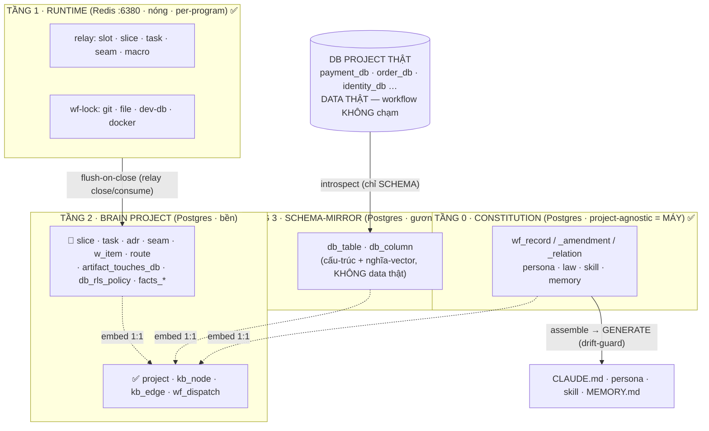
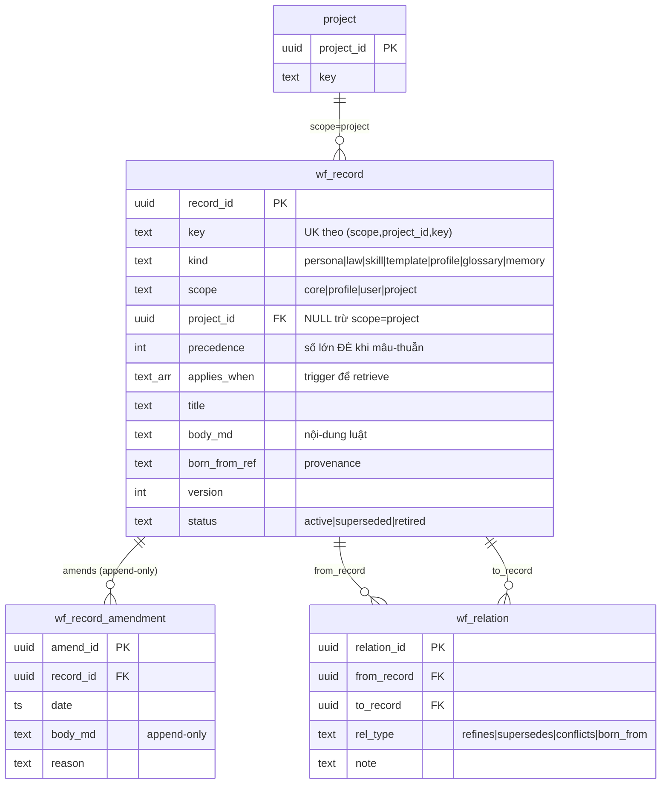
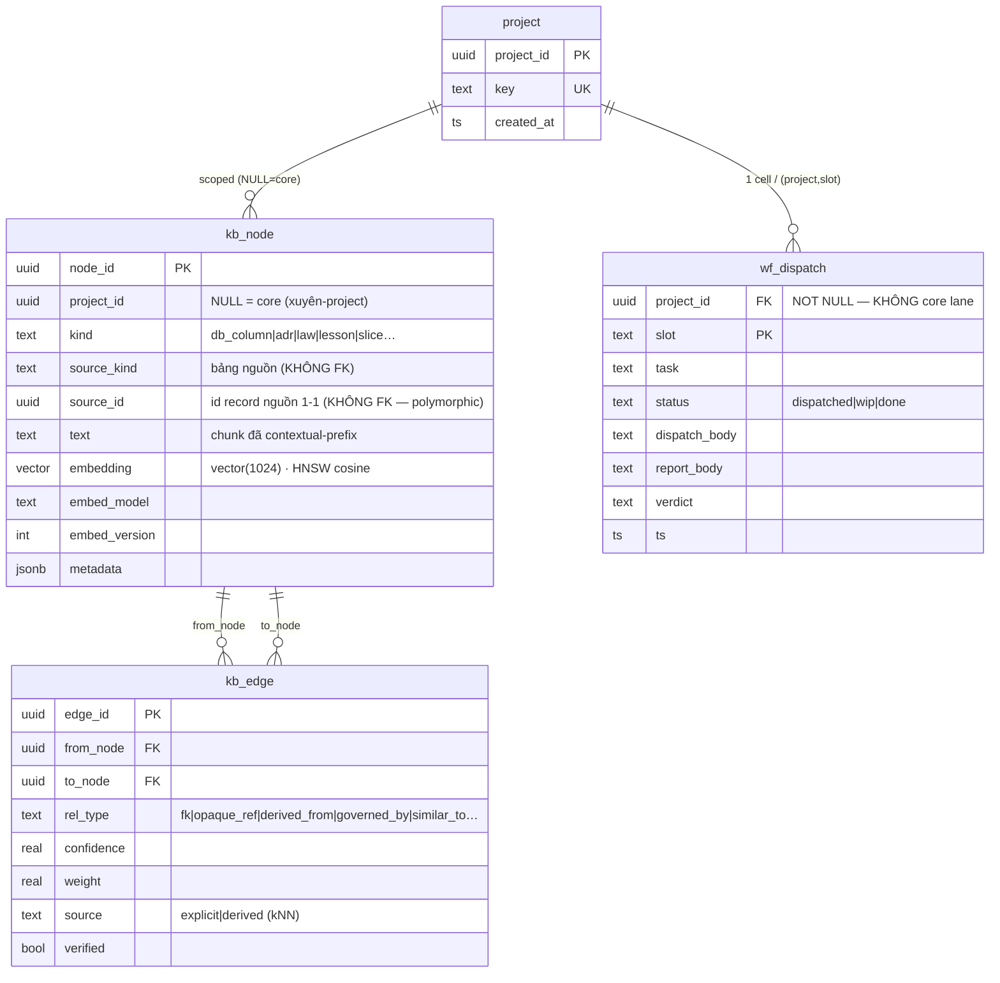
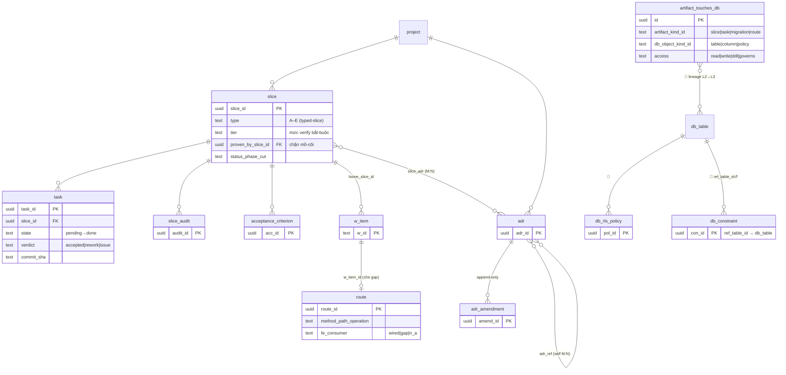
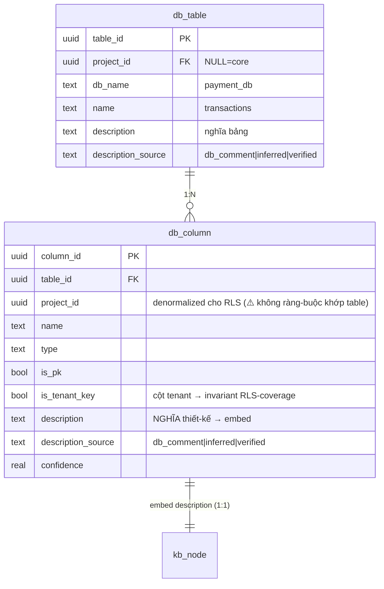
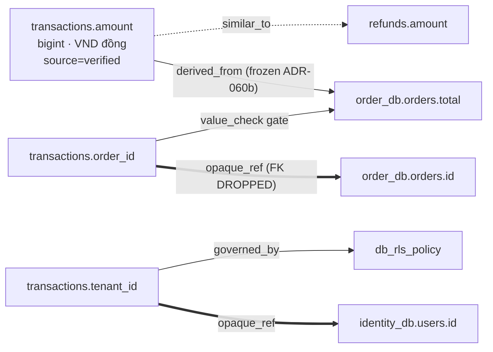
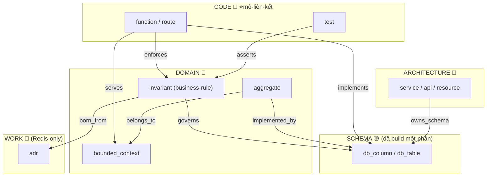

# AWF — ERD REVIEW (4 TẦNG + UCG) — để phân-tích thiết-kế

> **Mục-đích:** sơ-đồ ERD (thực-thể · thuộc-tính · quan-hệ chân-quạ) của toàn-bộ mô-hình dữ-liệu AWF, **phân biệt rõ ĐÃ-BUILD vs CHỈ-THIẾT-KẾ**, để review chỗ bất-hợp-lý trước khi build tiếp.
> **Nguồn sự-thật (rule §3 — không tin doc):** đọc thẳng schema `awf/constitution/schema.sql` + `awf/db/schema/{001_core,002_rls,003_dispatch}.sql` + grep bảng code engine/api thực dùng. Thiết-kế đầy-đủ: `docs/agentic-design-system-workflow.md` §1 + §1c.
> **Ngày:** 2026-07-14.

---

## 0. Cách đọc

**Ký-hiệu chân-quạ (Mermaid `erDiagram`):**
- `A ||--o{ B` = 1 A có 0..N B (one-to-many).
- `A ||--|| B` = 1-1.
- `A }o--o{ B` = N-N.
- `PK` khoá-chính · `FK` khoá-ngoại · `UK` unique.

**Trạng-thái mỗi thực-thể (QUAN-TRỌNG cho review):**
- ✅ **ĐÃ-BUILD** — có DDL thật + code engine/api đọc-ghi.
- 🟡 **BUILD một-phần** — bảng có, nhưng thiếu cột/ràng-buộc so với thiết-kế.
- 📐 **CHỈ-THIẾT-KẾ** — chỉ trong doc, **chưa 1 dòng DDL**. (Phần lớn "bộ não" nằm ở đây.)

**Tập bảng THỰC-SỰ tồn-tại (10):** `wf_record`, `wf_record_amendment`, `wf_relation`, `project`, `kb_node`, `kb_edge`, `wf_dispatch`, `db_table`, `db_column`, `schema_migrations`.

---

## A. Bản-đồ 4 TẦNG — kho vật-lý + luồng dữ-liệu

4 tầng LOGIC nhưng chỉ **2 kho VẬT-LÝ**: Redis (T1 nóng) và Postgres (T0+T2+T3 bền). "4 tầng" = phân-tầng-logic, KHÔNG phải 4 database.



> **Ranh-giới cứng:** T2 giữ **SCHEMA + metadata** của DB project (bảng gì, cột gì, RLS gì) + **NGHĨA** (vector), **KHÔNG** giữ **DATA** (không copy row users/orders). Tối đa giữ `row_estimate` để suy-luận.
> **Đọc kỹ mũi-tên `flush-on-close`:** nó trỏ vào cụm **📐 CHỈ-THIẾT-KẾ** — nghĩa là hôm nay Redis (T1) là **nhà thật DUY-NHẤT** của slice/task/seam; T2-spine chưa tồn-tại. (Xem §I.2.)

---

## B. TẦNG 0 · CONSTITUTION — ✅ ĐÃ-BUILD

Tri-thức workflow (persona/law/skill/memory) làm **record trong DB** thay vì file → workflow tự-chứa, hết phụ-thuộc file dễ hư. File `CLAUDE.md`/persona/`MEMORY.md` = **projection SINH ra** (drift-guard).



**Chốt T0:** memory = record (không file) · `[[wikilink]]` → cạnh `wf_relation` (graph, không text chết) · recall = SEMANTIC (embed vào `kb_node`) · `scope=core/user` xuyên-project, `project` riêng.

---

## C. TẦNG 1 · RUNTIME (Redis) — ✅ ĐÃ-BUILD — **KHÔNG phải ERD quan-hệ**

⚠️ T1 là **key-value (Redis)**, KHÔNG có bảng/FK/cardinality → **không vẽ được crow's-foot ERD thật**. Đây là seam mô-hình-dữ-liệu (KV bolt vào relational). Thể-hiện bằng cấu-trúc key:

```
namespace relay:  (atomic per-key ⇒ KHÔNG cần lock)
  relay:meta        ⟨HASH⟩  { mode · slots · goal · stamp }
  relay:macro       ⟨HASH⟩  { wave · next-cut }
  relay:macro:pending-human ⟨SET⟩
  relay:slices      ⟨SET⟩   index id mọi slice
  relay:seams       ⟨SET⟩   index id mọi seam
  relay:slot:<k>    ⟨HASH⟩  { state · task · slice · service }
       :dispatch    ⟨STRING⟩ body lệnh planner (5-lớp)
       :report      ⟨STRING⟩ body report coder
       :history     ⟨LIST⟩   report đã consume
  relay:slice:<id>  ⟨HASH⟩  { phase · cut · title · plan }
       :task:<T0N>  ⟨HASH⟩  { state · commit · verdict · carried · summary }
  relay:seam:<n>    ⟨HASH⟩  { involves · kind · note · depends · blocks }

namespace wf:  (wf-lock reader/writer, CAS + TTL 600s, WAIT không STEAL)
  wf:w:<res>  ⟨STRING⟩ owner   (WRITE độc-quyền, reentrant)
  wf:r:<res>  ⟨SET⟩    owners  (READ chia-sẻ)
  <res> ∈ { git · file · dev-db · docker }
```

**Ánh-xạ "quan-hệ" ngầm (bằng CONVENTION, không FK):** `slot.slice → slice:<id>` · `slot.task → slice:<id>:task:<T0N>`. Vòng-đời 1 task đi qua 3 subkey slot: `:dispatch`(planner) → `:report`(coder) → `:history`(consume).

> **Điểm review (§I.2):** slice/task/seam ở đây **trùng khái-niệm** với cụm project-metadata 📐 của T2. Thiết-kế nói "flush-on-close" đồng-bộ Redis→Postgres, nhưng đó là **sync-seam** — nguồn drift kinh-điển.

---

## D. TẦNG 2 · BRAIN PROJECT (Postgres)

### D.1 — ✅ Phần ĐÃ-BUILD (semantic mesh + dispatch)



**Đặc-điểm quan-trọng để review:**
- `kb_node.source_id` = **polymorphic, KHÔNG FK** → trỏ mọi bảng (wf_record/db_column/slice…) qua `source_kind`. Không CASCADE cross-bảng → **orphan-risk** khi source bị xoá.
- `kb_node` = **projection 1:1 của MỌI record** (I1 bất-biến "một store pgvector"). ⟹ text/nghĩa sống **2 nơi**: bảng-nguồn + `kb_node.text`.
- `kb_edge` **KHÔNG có `project_id`** → isolation qua **node-visibility** (edge hiển-thị iff CẢ 2 đầu là kb_node hiển-thị với project hiện-tại).
- `wf_dispatch` = **mirror `scripts/relay` trong DB**, project-scoped + RLS FORCE (A⊥B tuyệt-đối, KHÔNG core lane). PK `(project_id, slot)`.

### D.2 — RLS (002/003_rls) — A⊥B fail-closed

| Bảng | project_id? | READ (USING) | WRITE (CHECK) | Core lane? |
|---|---|---|---|---|
| `db_table` `db_column` `kb_node` | ✅ | `= GUC OR IS NULL` | `= GUC` | ✅ (NULL=public) |
| `kb_edge` | ✖ (dùng subquery) | cả 2 đầu node visible | cả 2 đầu node visible | theo node |
| `wf_dispatch` | ✅ NOT NULL | `= GUC` (STRICTER) | `= GUC` | ✖ (no core) |
| `project` | — | GLOBAL đọc (bootstrap GUC) | admin path | — |

Fail-closed: `NULLIF(current_setting('app.project_id',true),'')::uuid → NULL` khi GUC chưa set / pooled-residue `''` (bài học sicp V013 — bare `''::uuid` sẽ THROW). Role runtime `awf_app` = NOBYPASSRLS; engine hiện nối superuser `awf` (BYPASSRLS) nên RLS chỉ "cắn" khi API cut sang `awf_app`.

### D.3 — 📐 Phần CHỈ-THIẾT-KẾ (cụm project-metadata + catalog-đầy-đủ + lineage) — **CHƯA BUILD**

Đây là "bộ não WORK" mà doc §1 vẽ rất to nhưng **chưa có DDL**. Hôm nay sống ở Redis (T1) / file (BACKLOG/FACTS/PARITY).



> **Toàn-bộ khối trên = 📐.** `slice`/`task`/`adr`/`seam`/`w_item`/`route` = grep code engine/api **không tham-chiếu** → xác-nhận chưa build. `db_rls_policy`/`db_constraint`/`db_migration`/`facts_snapshot`/`facts_entry`/`artifact_touches_db` = cũng chưa.

---

## E. TẦNG 3 · SCHEMA-MIRROR — 🟡 BUILD một-phần

Cấu-trúc **gương** DB project (bảng/cột giống thật) + mỗi field 1 **giải-thích thiết-kế lưu VECTOR** → search semantic "field này thiết-kế để làm gì". **KHÔNG data thật.** Vật-lý nằm trong T2 (cùng Postgres): `db_table`/`db_column` + `kb_node.embedding`.



**So thiết-kế vs thực-tế:** doc §1 muốn T3 còn `db_rls_policy`/`db_constraint`/`db_migration` (để suy-luận RLS-coverage, FK-graph, migration-order) → **chưa build** ⇒ T3 hiện chỉ mô-tả được *bảng + cột + nghĩa*, **chưa** mô-tả được *ràng-buộc/RLS/FK* ⇒ chưa đủ để trả câu "field này bị RLS nào gác?".

---

## F. VÍ-DỤ TẦNG 3 — `payment_db.transactions` (worked example)

Đây là **đích cuối** của T3: soi 1 bảng thật, gắn nghĩa từng field, tái-dựng quan-hệ đã mất (microservices DROP FK cross-DB). Mỗi field = 1 `db_column` (+ 1 `kb_node` embedding); mỗi "kết-nối" = 1 `kb_edge`.

### F.1 — Field + nghĩa thiết-kế (cái được vector-hoá)

| Field | Type | Giải-thích thiết-kế (→ vector) | Kết-nối (`kb_edge` rel_type) | Nguồn |
|---|---|---|---|---|
| id | uuid PK | Khoá chính giao-dịch | ◄ `refunds.transaction_id` `[referenced_by]` | inferred |
| tenant_id | uuid | Tenant sở-hữu; NGUỒN RLS (GUC `app.tenant_id`) | → `tenants` `[opaque_ref]` · → `db_rls_policy` `[governed_by]` | db_comment |
| order_id | uuid | Ref order-svc; cổng tenant-money | → `order_db.orders.id` `[opaque_ref]` (FK dropped) · gate vs `orders.total` `[value_check]` | db_comment |
| user_id | uuid | Người khởi-tạo | → `identity_db.users.id` `[opaque_ref]` | inferred |
| **amount** | bigint | **Số tiền — VND ĐỒNG, KHÔNG cents** (verified 67k–549k) | ◄ `orders.total` `[derived_from]` (frozen ADR-060b) · ≈ `refunds.amount` `[similar_to]` | **verified** |
| status | varchar | pending/success/failed | → payment saga events `[drives]` | inferred |
| provider | varchar | vnpay/vietqr/momo/zalopay | → payment adapters `[enum_domain]` | inferred |
| provider_txn_id | varchar | Mã phía cổng | → reconcile flow `[used_by]` | inferred |
| external_id | varchar | ID ngoài (idempotency) | (idempotency key) | inferred |
| seed_batch_id | uuid | Tag lô seed (test) | → `seed_batch` `[opaque_ref]` | inferred |

### F.2 — Đồ-thị kết-nối (kb_edge) — **cái microservices làm mất, workflow tái-dựng**



> **Đọc:** hỏi *"field nào giữ tiền, đơn-vị gì?"* → vector kéo `amount` + đọc nghĩa *"VND đồng, frozen từ order.total"* ⇒ **hiểu THIẾT-KẾ mà KHÔNG chạm data**. Quan-hệ `order_id ↔ orders.id` là **FK đã DROP** (microservices) → introspect không thấy → workflow tái-dựng thành `opaque_ref` edge tường-minh. Đây là **giá-trị lõi** mà Cursor/introspect thuần KHÔNG có.
> **Kỹ-thuật traverse:** `WITH RECURSIVE` trên `kb_edge` (Postgres thuần); sâu hơn → Apache AGE (openCypher) — vẫn 1 store cạnh pgvector, KHÔNG Neo4j riêng.

---

## G. UCG OVERLAY — 📐 CHỈ-THIẾT-KẾ (tầng NGHĨA chồng lên T2/T3)

UCG = "Unified Comprehension Graph": nâng "4 tầng lưu-trữ" thành **hiểu project như kiến-trúc-sư** — *"đây là [ARCHITECTURE] hiện-thực [DOMAIN] qua [CODE] trên [SCHEMA]"*. **CHƯA build 1 dòng** — đây là phần "special algorithm" (xem §I.7).

### G.1 — 5 tầng-node MESH (ontology mượn chuẩn, không tự-chế)

| Tầng-node | Chuẩn de-facto | Node kinds | Trạng-thái |
|---|---|---|---|
| **ARCHITECTURE** | Backstage catalog + C4 | system · service · api · resource · deployment_unit · owner | 📐 |
| **DOMAIN** | DDD strategic-design | bounded_context · aggregate · entity · domain_event · invariant | 📐 |
| **CODE** ⭐ | Code-Property-Graph / Glean | module · function · route · class · test · saga | 📐 |
| **SCHEMA** (=T3) | — | db_table · db_column · db_rls_policy · db_constraint | 🟡 (table/column ✅) |
| **WORK** (=T2) | — | slice · task · adr · w_item · seam · route | 📐 (Redis-only) |



### G.2 — 7 cơ-chế hạng-nhất (mỗi cái giải 1 vấn-đề)

| # | Cơ-chế | Giải | Trạng-thái |
|---|---|---|---|
| M1 | CODE-layer + cross-edges | mesh không spine (hàm nào giữ luật X?) | 📐 |
| M2 | JOINT-inference (constraint-propagation) | nhất-quán xuyên tầng (arch↔domain↔field mâu-thuẫn → flag) | 📐 **⭐wedge** |
| M3 | EPISTEMIC (confidence · gap-detector · active-question) | tự-biết-giới-hạn (chống "kẻ-nói-dối-tự-tin") | 📐 **⭐wedge** |
| M4 | DUAL-GROUNDING (static + dynamic trace/test) | grounded reality (flow khớp trace? invariant khớp test?) | 📐 **⭐wedge** |
| M5 | SOURCE-RESOLUTION (declared vs discovered + staleness-decay) | declare↔infer có nguyên-tắc | 📐 |
| M6 | INCREMENTAL + SCALE (`--since <sha>` + propagate) | 60+ bảng / 100k-LOC | 📐 |
| M7 | CO-PRODUCTION (relay flush ghi cả tri-thức domain/arch) | đồng-sản-xuất khi làm | 📐 |

> **Điều-kiện-hoá engine (`conditioning_rule` — law-kind mới ở T0):** `when arch.X → activate Y`, degrade CONSERVATIVE. Vd `microservices → opaque_ref + Type-D + A⊥B-cross-svc` · `nestjs → module-3-layer` · `multi_tenant → RLS-coverage`. **📐 chưa build.**

---

## H. MA-TRẬN BUILT vs DESIGNED

| Vùng | Thực-thể | Trạng-thái |
|---|---|---|
| T0 constitution | `wf_record` · `wf_record_amendment` · `wf_relation` | ✅ |
| T1 runtime | Redis relay + wf-lock | ✅ (KV, không ERD) |
| T2 semantic | `kb_node` · `kb_edge` | ✅ |
| T2 dispatch | `wf_dispatch` | ✅ |
| T2 root | `project` | ✅ |
| T2 project-metadata | `slice` · `task` · `adr` · `seam` · `w_item` · `route` · `slice_audit` · `acceptance_criterion` · `adr_ref` · `slice_adr` · `log_catalog_entry` | 📐 (Redis/file-only) |
| T2 lineage | `artifact_touches_db` | 📐 |
| T3 mirror | `db_table` · `db_column` | ✅ |
| T3 mirror-đầy-đủ | `db_rls_policy` · `db_constraint` · `db_migration` · `facts_snapshot` · `facts_entry` | 📐 |
| UCG mesh | ARCHITECTURE · DOMAIN · CODE node-tiers | 📐 |
| UCG cơ-chế | M1–M7 · conditioning_rule | 📐 |

**Tỉ-lệ:** hạ-tầng lưu-trữ + semantic + dispatch = ĐÃ build (phần "cơ-khí"). **Toàn-bộ phần "hiểu" (domain/arch/code/joint-infer/grounding) = CHƯA build.**

---

## I. ⚠️ ĐIỂM BẤT-HỢP-LÝ / CẦN REVIEW (adversarial — góc nhìn brain)

> Đây là phần anh cần soi nhất. Mỗi điểm = 1 rủi-ro thiết-kế cụ-thể, có địa-chỉ.

**I.1 — Chiến-lược ⟂ kiến-trúc (mâu-thuẫn LỚN NHẤT).**
Kết-luận chiến-lược hôm nay (memory `awf-strategic-reconsider`): *heavy semantic-retrieval là PREMATURE với model mạnh + 1M context; đọc file thẳng thắng; comprehension TÁCH được khỏi retrieval + nên LIGHT.* Nhưng kiến-trúc T2/T3/UCG **dựng quanh `kb_node.embedding` + pgvector HNSW làm TRỤC truy-xuất** — đúng chỗ human bảo chưa cần. ⟹ **embedding nên additive/dormant, KHÔNG load-bearing.** Giá-trị comprehension (edge/invariant/graph) lấy được bằng query **quan-hệ/graph** (`WITH RECURSIVE`, AGE) **không cần vector**. Schema hiện fuse 2 thứ (mọi node PHẢI có embedding mới "tìm thấy") → nên tách.

**I.2 — 1-fact-2-nhà (vi-phạm chính bất-biến I5 + §3 chống-trùng).** 3 chỗ:
- `slice`/`task`/`seam`: sống ở **Redis (T1)** VÀ (thiết-kế) **Postgres cluster-b (T2)** qua "flush-on-close". Hiện cluster-b chưa build ⇒ T2-spine = **vaporware**, Redis là nhà thật. Khi build → sync-seam drift.
- `kb_node.text` **copy** `body_md`/`description` từ bảng-nguồn ⇒ nghĩa ở 2 nơi, gánh re-embed/đồng-bộ, không thấy trigger/CDC giữ khớp.
- `wf_dispatch` (DB) **mirror `scripts/relay`** (Redis) — dispatch 2 nhà. Ai authoritative? Doc không chốt.

**I.3 — `db_column.project_id` denormalized KHÔNG ràng-buộc khớp `db_table.project_id`.** (`001_core.sql:25`) Không CHECK/FK-composite/trigger ⇒ 1 column có thể mang `project_id` khác table cha ⇒ **RLS lọc sai** (đọc/ghi nhầm project). Đây là lỗ A⊥B tiềm-ẩn — cần composite FK `(table_id, project_id)` hoặc trigger.

**I.4 — `kb_node.source_id` polymorphic, KHÔNG FK.** Trỏ mọi bảng qua `source_kind` (`001_core.sql:41-42`) ⇒ khi source (wf_record/db_column…) bị xoá, kb_node **mồ-côi** (không CASCADE cross-bảng). Cần dọn-rác hoặc FK-per-kind.

**I.5 — `kb_edge` isolation qua subquery = đúng nhưng ĐẮT ở đúng chỗ cần nhanh.** Không có `project_id`; mỗi truy-cập edge chạy 2 `EXISTS` trên `kb_node` (`002_rls.sql:84-92`). Traverse graph sâu (`WITH RECURSIVE`/AGE — chính là "hiểu sâu") nhân subquery theo độ-sâu ⇒ chậm ở đúng workload lõi. Cân-nhắc denormalize `project_id` lên edge (như column) đổi lấy tốc-độ.

**I.6 — Double-framing "4 tầng" vs "5 node-tier" (lặp khái-niệm).** Mesh (`kb_node`/`kb_edge`) **nằm vật-lý trong T2** nhưng **logic index cả T0+T2+T3** (+ ARCH/DOMAIN/CODE thiết-kế). ⟹ T2 vừa "là 1 tầng" vừa "chứa chỉ-mục xuyên-tầng" = vòng-lặp. UCG nói "§1 vẫn đúng, UCG chồng lên" nhưng lại gộp T2=WORK-node-tier, T3=SCHEMA-node-tier → **2 bản-đồ đè nhau**, người đọc lạc. Cần chọn 1 khung chuẩn (đề-xuất: mesh là mô-hình LOGIC gốc; "4 tầng" chỉ là partition vật-lý của mesh).

**I.7 — "Special algorithm" đánh Cursor nằm ở phần CHƯA BUILD + rủi-ro nhất.** Cái đã-build (embedding-retrieval, catalog, dispatch) ≈ phần **Cursor/Sourcegraph/Backstage làm rồi** (~70% wheel). Wedge thật (nếu có) = **M2 joint-inference** (phát-hiện mâu-thuẫn arch↔domain↔field) + **M4 dual-grounding** (flow khớp trace, invariant khớp test) + **M3 epistemic** (tự-biết-gap) — **cả 3 = 📐, chưa 1 dòng code, chưa chứng-minh.** ⟹ ERD cho thấy nghịch-lý: **cái đã xây = dễ-copy; cái là-wedge = chưa xây + khó nhất.** Nếu tin "thuật-toán đặc-biệt thắng Cursor" thì thuật-toán ĐÓ là M2/M3/M4, và bước tiếp đúng-đắn = **chứng-minh 1 cơ-chế trên 1 bug-class thật** (tenant-leak / money-rounding / migration-break) TRƯỚC, không build 10-slot.

**I.8 — T3 chưa đủ để trả câu hỏi RLS/FK.** Thiếu `db_rls_policy`/`db_constraint` (📐) ⇒ hiện T3 mô-tả được *bảng+cột+nghĩa* nhưng **chưa** *ràng-buộc/RLS/FK* ⇒ chưa trả được *"field này bị policy nào gác? đổi nó vỡ FK nào?"* — đúng loại câu hỏi high-consequence mà wedge cần.

---

### Tóm-tắt 1 dòng cho anh phân-tích
Hạ-tầng "cơ-khí" (lưu-trữ + embedding + dispatch) đã xây **chắc** nhưng **trùng phần Cursor có sẵn** và **đi ngược kết-luận "retrieval chưa cần"**; phần thật-sự là wedge (**hiểu domain + joint-infer + grounding**) vẫn **📐 nằm trên giấy**. Đề-xuất: coi embedding là *additive*, kéo mesh/edge/invariant lên làm trục *quan-hệ/graph light*, và **chứng-minh M2/M3/M4 trên 1 bug-class** trước khi bung schema đầy-đủ.
