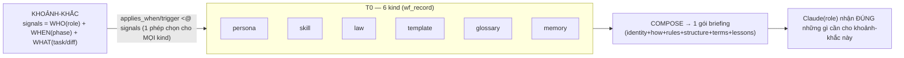
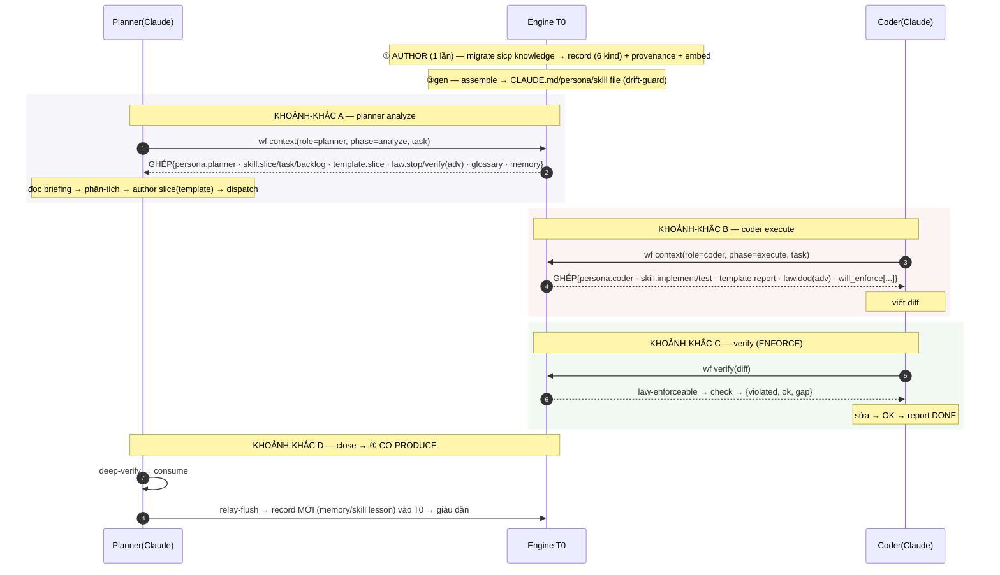

# T0 — BLUEPRINT TOÀN-DIỆN + FLOW PHỐI-HỢP 6 KIND

> Bức tranh ĐẦY-ĐỦ của T0 trước khi làm lại: 6 kind là gì · lưu chung ra sao · **6 kind PHỐI-HỢP thế nào trong 1 khoảnh-khắc** (trọng-tâm) · vòng-đời · 2 đường phục-vụ · delta "làm lại".
> File MỚI, độc-lập (không thay ERD.md/T0-V2-*.md). **Ngày:** 2026-07-14.

---

## 1. T0 CHỨA GÌ — bộ-não vận-hành (6 kind)

| kind | Trả lời | Ví-dụ | Đường phục-vụ |
|---|---|---|---|
| **persona** | Mày LÀ ai? | planner=brain · coder=execute-in-isolation | KNOW |
| **skill** ⭐ | Mày LÀM việc-X thế nào? | phân-tích-slice (A–E+tier) · chia-task · phân-tích-backlog · implement-against-contract | KNOW |
| **law** | Mày phải/không được gì? | tenant-gate · verify-depth · stop-conditions | KNOW (advisory) **+ ENFORCE (check)** |
| **template** | Khuôn dùng lại | form prompt 5-lớp · slice-template · report-format | KNOW |
| **glossary** | Thuật-ngữ | seam · W-ID · strangler · Type-D | KNOW |
| **memory** | Bài-học tích-luỹ | slice-taxonomy · anti-over-hold · big-slice-pref | KNOW |

**Chốt:** T0 = *biết-LÀ (persona) + biết-LÀM (skill) + biết-PHẢI (law) + khuôn (template) + từ (glossary) + kinh-nghiệm (memory)*. **Chỉ law có nhánh ENFORCE**; 5 kind kia thuần KNOW (Claude đọc & làm).

---

## 2. LƯU-TRỮ THỐNG-NHẤT — cả 6 kind = 1 bảng `wf_record`

```
wf_record: record_id · key · KIND · scope(core/profile/project) · applies_when[] · trigger(jsonb)
           · body_md · born_from_ref · version · status · enforcement(advisory|enforceable)
   └─ law-enforceable mang THÊM: wf_check (+fixture) · detector
   └─ 5 kind kia + law-advisory: chỉ body_md + applies_when/trigger
```
→ Khác nhau ở `kind` + phần mở-rộng, KHÔNG phải 6 bảng. 1 phép chọn dùng chung cho tất-cả.

---

## 3. ⭐ FLOW PHỐI-HỢP — 6 kind HỢP-LỰC trong 1 KHOẢNH-KHẮC

**Nguyên-lý cốt-lõi (đây là câu trả-lời "phối-hợp"):** 6 kind KHÔNG chạy như 6 hệ rời. Chúng được **ĐỒNG-CHỌN** bởi cùng 1 phép so tín-hiệu, rồi **ĐỒNG-GHÉP** thành 1 gói briefing cho đúng khoảnh-khắc.



**Cơ-chế phối-hợp = ĐỒNG-CHỌN + ĐỒNG-GHÉP:** một khoảnh-khắc phát ra tín-hiệu `{role, phase, task/diff}`; engine chạy **cùng 1** `trigger <@ signals` trên **cả 6 kind**; các record khớp (thuộc nhiều kind khác nhau) được **ghép** thành 1 gói mạch-lạc. Kind nào có record khớp thì góp mặt; không thì vắng.

### Kịch-bản THẬT 1 — Planner phân-tích slice
Khoảnh-khắc: `signals = {role:planner, phase:analyze, topic:slice, topic:backlog}`
```
ĐỒNG-CHỌN (cùng phép <@ trên 6 kind):
  persona   → persona.planner              (WHO=planner)      → "mày là brain, decompose, anti-over-hold"
  skill     → skill.slice-analysis         (planner+slice)    → "phân A–E + gán verify-tier, ưu Type-A"
            → skill.task-decompose         (planner+decompose)→ "tách gated-task, đừng over-hold"
            → skill.backlog-analysis       (planner+backlog)  → "đọc backlog, chọn slice độc-lập-đủ"
  template  → template.slice               (topic:slice)      → khuôn goal/boundary/tasks/acceptance/stop
  law(adv)  → law.stop-conditions          (planner)          → "STOP khi đụng schema/dep ngoài scope"
            → law.verify-depth             (planner+verify)   → "deep-verify high-consequence"
  glossary  → {seam, W-ID, Type-D}         (topic khớp)       → nghĩa thuật-ngữ
  memory    → {slice-taxonomy, anti-over-hold, big-slice-pref}→ bài-học
ĐỒNG-GHÉP → 1 gói:
  wf context(planner, analyze, task) = { identity, how_to[3 skill], structure, rules[2 law-adv],
                                         terms, lessons, will_enforce:[] }
```
→ Planner-Claude nhận **trọn** *ai + làm-sao + luật + khuôn + từ + kinh-nghiệm* cho đúng việc phân-tích slice. **Đó là phối-hợp.**

### Kịch-bản THẬT 2 — Coder thực-thi
Khoảnh-khắc: `signals = {role:coder, phase:execute, WHAT: data-path, new-route}`
```
persona  → persona.coder            → "execute-in-isolation, 1 boundary"
skill    → skill.implement-against-contract · skill.embedded-test-right-tier
template → template.report-format
law(adv) → law.dod-embedded         → hướng-dẫn DoD
law(ENF) → will_enforce: [tenant-gate, migration-fwd, single-home]  ← vì WHAT=data-path/route
memory   → {vitest-tenant-collision, ...}
GHÉP → coder briefing: identity + how + template + DoD + "3 luật SẼ bị kiểm khi verify"
```
→ Coder biết TRƯỚC 3 luật sẽ bị enforce → viết cho đúng.

### Kịch-bản THẬT 3 — Verify (đường ENFORCE)
Khoảnh-khắc: `signals = {phase:verify, diff-signals: data-path, new-route}`
```
law(ENF) → chọn [tenant-gate, single-home, fe-be-parity] → CHẠY check → verdict
skill    → skill.deep-verify (nếu role=planner)  → hướng-dẫn planner deep-verify
gap      → signal nổ chưa phủ → báo
```
→ Đây là khoảnh-khắc DUY-NHẤT dùng đường ENFORCE (law-enforceable chạy check). 5 kind kia vắng mặt (không hợp verify).

---

## 4. VÒNG-ĐỜI 4 CHẶNG (chung mọi kind) + phối-hợp planner↔coder



**Phối-hợp planner↔coder qua T0:** cả hai **rút từ CÙNG T0** (skill/law/persona của vai mình) + **đóng-góp lại T0** (④ flush → lesson mới). T0 là **bộ-não-chung** hai vai vừa dùng vừa bồi.

---

## 5. HAI ĐƯỜNG PHỤC-VỤ (③ SERVE) — vì sao 6 kind rẽ

| | Đường KNOW (advisory) | Đường ENFORCE (deterministic) |
|---|---|---|
| Kind | persona · skill · template · glossary · memory · **law-advisory** | **CHỈ law-enforceable** |
| Cách | Claude ĐỌC & tự làm (reasoning-split) | engine CHẠY check trên diff |
| Verb | `wf gen` (nền) + `wf context` (đúng lúc) | `wf verify` |
| Đảm-bảo | mềm (hướng-dẫn) | cứng (bắt-lỗi) |

→ 5 kind + law-advisory = *dạy Claude làm*; law-enforceable = *kiểm Claude đã làm đúng*. Cùng ①②④, khác ③.

---

## 6. "LÀM LẠI T0" = delta so hiện-tại (đã có gì · thêm gì)

| Chặng | Hiện có | Làm lại thêm |
|---|---|---|
| ① AUTHOR | persona+law (15 F) | **migrate skill/template/glossary/memory** vào record |
| ② SELECT | ✗ (gen dump HẾT) | **trigger + signal 3-trục + ĐỒNG-CHỌN + `wf context`** |
| ③ gen | ✅ CLAUDE.md drift-guard | + persona/skill projection |
| ③ enforce | ✗ (guard bash rời CI) | **law-enforceable + check + `wf verify`** |
| ④ CO-PRODUCE | ✗ | **relay-flush → record mới** |
| REUSE | ✗ (hardcode ICP) | **core/profile/project binding** |

⟹ Nâng T0 từ *máy-sinh-CLAUDE.md (persona+law)* → *bộ-não-vận-hành đầy-đủ: 6-kind · đồng-chọn-theo-khoảnh-khắc · kiểm-được · tái-dùng-được · tự-giàu*.

---

## 7. CHỐT (bức tranh 1 màn)

```
T0 = 6 kind (persona·skill·law·template·glossary·memory) trong 1 bảng wf_record
        │
   ① AUTHOR (nguồn sicp → record + provenance + embed)
        │
   ② SELECT: 1 khoảnh-khắc {role·phase·task/diff} → 1 phép <@ trên CẢ 6 kind → ĐỒNG-CHỌN
        │
   ③ SERVE (ĐỒNG-GHÉP thành 1 gói):
        ├─ KNOW  (5 kind + law-adv) → wf gen / wf context → Claude ĐỌC & LÀM
        └─ ENFORCE (law-enf)        → wf verify → engine CHẠY check
        │
   ④ CO-PRODUCE: relay-flush → record mới → T0 giàu dần
        │
   REUSE: core ⊕ profile ⊕ project (wf.toml) → dùng lại mọi project
```

**Phối-hợp = đồng-chọn + đồng-ghép theo khoảnh-khắc.** Không phải 6 hệ rời; là 6 mặt của MỘT bộ-não, được lắp đúng mặt cho đúng lúc/đúng vai.
