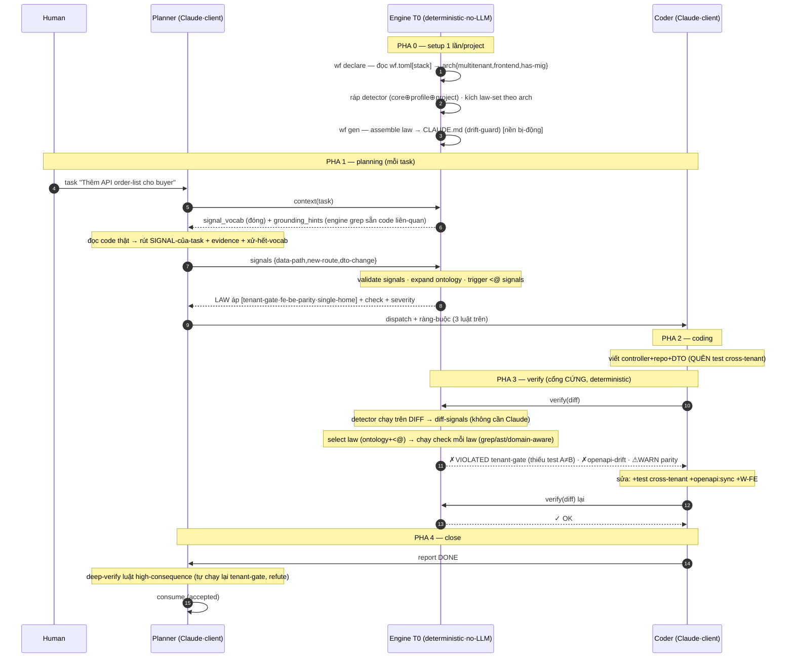

# T0 — FLOW HOÀN-CHỈNH + ĐÁNH-GIÁ (để review)

> Ráp toàn-bộ T0-v2 thành 1 flow chạy được để anh soi. Kèm: (1) sửa mục-đích T0, (2) flow đầy-đủ, (3) current vs new ưu/khuyết, (4) "exact-match" đủ chưa + cách thông-minh hơn.
> **Ngày:** 2026-07-14 · dựa trên code thật đã đọc (`constitution/*`, `guards.yml`, `db/schema/*`).

---

## 1. MỤC-ĐÍCH T0 (sửa hiểu-lầm phổ-biến)

**T0 = nhà của LUẬT.** Nó KHÔNG "gửi luật cho Claude để Claude rút signal-của-luật". Hướng đúng:

```
task  ──(Claude đọc, rút)──►  SIGNAL-của-task
                                   │
                                   ▼
SIGNAL  ──(engine SO)──►  trigger-của-LAW (đã lưu sẵn)  ──►  LAW áp  ──►  engine CHẠY check
```

- Claude rút **signal của TASK**, không phải "signal của law".
- `trigger` của mỗi law **đã lưu sẵn** trong DB — không ai rút từ law.
- **Engine chọn law** (bằng phép so), KHÔNG phải Claude.

**T0 làm 2 vai:**
| Vai | Việc | Trạng-thái |
|---|---|---|
| **Bị-động** | ráp law → sinh `CLAUDE.md` cho Claude đọc làm nền | ✅ đã có |
| **Chủ-động** | giữ `trigger`+`check`; khi có task/diff → CHỌN law áp + CHẠY check | 🆕 T0-v2 |

---

## 2. FLOW ĐẦY-ĐỦ (5 pha)



**Điểm neo của mỗi pha:**
- **Pha 1 (signal từ task):** MỀM — Claude rút, engine validate. Xem-trước để planner phân task.
- **Pha 3 (signal từ diff):** CỨNG — detector đọc artifact, không cần Claude. **Đảm-bảo nằm ở đây.** Pha 1 sót → pha 3 bắt.
- Cả 2 pha đều dùng CÙNG phép chọn-luật (`trigger <@ signals` + ontology), khác nhau ở **nguồn signal** (Claude vs detector).

---

## 3. CURRENT vs NEW — ưu/khuyết (thẳng, không thổi phồng)

### Workflow HIỆN-TẠI (CLAUDE.md prose + 10 guard bash + CI)
**Ưu:**
- **Đơn-giản, 0 hạ-tầng thêm** — chỉ file + bash + CI. Chạy được ngay.
- **Đã chứng-minh** — ship 1 product thật bằng nó.
- Claude đọc **toàn-bộ luật làm nền** → hợp luật *phán-đoán* (prose).
- Guard đã bắt được vài thứ chủ-chốt (drift/commit/tenant-route).

**Khuyết:**
- Luật là **prose Claude có-thể quên/sót** — phần lớn luật KHÔNG được kiểm per-diff.
- Check **chạy muộn (CI sau push)**, **rời** khỏi luật, **hardcode ICP**.
- **Không tái-dùng** project khác.
- **Không báo Claude** luật nào áp / confidence / gap.

### Workflow MỚI (T0-v2: law-record + trigger + check + engine select/verify)
**Ưu:**
- Luật **thi-hành INLINE (trước push)**, **nối** với check.
- Engine **tự chọn luật áp** per task/diff → Claude **không dựa trí-nhớ**.
- **Tái-dùng** (signal/law phổ-quát, binding per-project).
- **Epistemic** (confidence, gap, "not_run" minh-bạch).
- **Domain-aware** (check neo `is_tenant_key`) = wedge deterministic.

**Khuyết:**
- **Phức-tạp hơn** — bảng mới, detector, verb engine, hook.
- **Chưa chứng-minh** bắt được cái Cursor sót (cần wedge-experiment).
- **Tốn công author** — trigger, check, fixture, detector, ontology.
- Chỉ **nhóm high-consequence** thành enforceable; còn lại vẫn prose.
- Phần *chính-xác* phụ-thuộc **domain-model đã điền** (`is_tenant_key` introspect).

### Verdict thẳng
New **thêm năng-lực thật** (enforce inline + tái-dùng + domain-aware) nhưng **đắt phức-tạp + chưa chứng-minh**. Bước đúng: **chứng value trên 1 bộ enforceable nhỏ (5 luật đã có bash) + 1 wedge-experiment** TRƯỚC khi build đầy-đủ. Hiện-tại, file+bash+CI vẫn **đủ tốt để xây ICP**; T0-v2 là **đường tiến-hoá có kiểm-chứng**, không phải thay-thế gấp.

---

## 4. "EXACT MATCH" — đủ chưa? cách thông-minh hơn?

`trigger <@ signals` = khớp **chính-xác** trên tag phẳng.

**Đánh-giá:** cho **đảm-bảo** thì exact là ĐÚNG (enforcement cần dứt-khoát, không "có-thể áp"). Nhưng exact-phẳng **cứng** (chỉ AND-tag, tên phải trùng). Nâng **thông-minh mà VẪN deterministic** (không fuzzy):

| Nâng-cấp | Giải | Vẫn deterministic? |
|---|---|---|
| **1· chuẩn-hoá đồng-nghĩa** | `data-write`→canonical `data-path` (bảng tra) | ✅ |
| **2· cây phân-cấp tag (ontology)** | `money-path` là-con `data-path` → signal money-path tự kích luật trigger data-path | ✅ (đồ-thị cố-định, bung tổ-tiên rồi `<@`) |
| **3· logic vị-từ (jsonb)** | `migration-file AND version≥15` · `data-path AND NOT read-only` | ✅ (evaluator nhỏ) |

Ví-dụ ontology:
```
data-path
 ├── money-path      (signal money-path → kích cả luật trên data-path)
 ├── auth-path
 └── tenant-data
external-io
 ├── payment-call
 └── llm-call
```

**Fuzzy/embedding chỉ dùng cho:** luật *advisory* (gợi-ý mềm) + **đề-xuất** synonym/ontology cho human duyệt. **KHÔNG ở cổng cứng** (giữ đảm-bảo deterministic = wedge).

**Thật-thà — điểm nghẽn "đầy-đủ" KHÔNG ở toán-tử khớp:** mà ở **độ phủ signal-vocab + detector**. Điều-kiện 1 luật không có signal/detector bắt → không toán-tử nào cứu. ⟹ đầu-tư vào **phủ signal/detector**, không phải làm match fuzzy.

---

## 5. Chốt review
- **T0 = nhà luật**, làm 2 vai: sinh CLAUDE.md (nền) + chọn-luật-áp & chạy-check (enforce). Claude đưa signal-task; **engine chọn luật**, không phải Claude.
- **Flow:** pha-1 signal-từ-task (mềm, xem-trước) + pha-3 signal-từ-diff (cứng, đảm-bảo). Cùng phép chọn-luật, khác nguồn signal.
- **Current** đơn-giản/proven nhưng muộn/rời/không-tái-dùng; **New** inline/nối/tái-dùng/domain-aware nhưng phức-tạp/chưa-chứng-minh → prove nhỏ trước.
- **Exact-match** đúng cho đảm-bảo; nâng thông-minh bằng **ontology + logic (vẫn deterministic)**, fuzzy chỉ cho advisory. Nghẽn thật ở **phủ signal/detector**.
