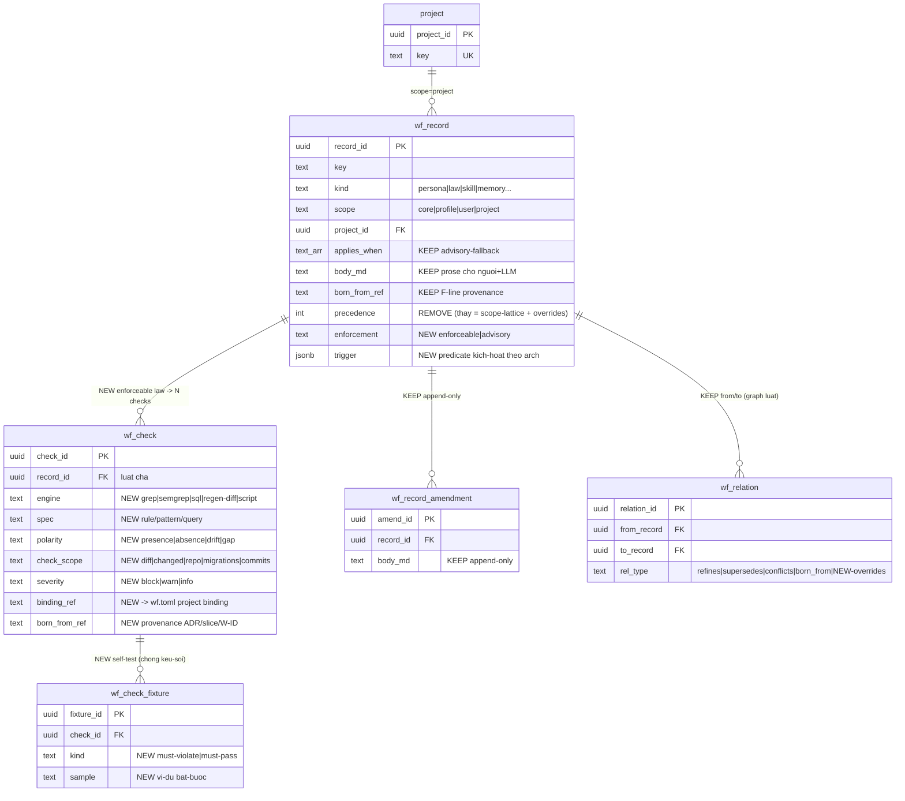

# T0-v2 — ENFORCEABLE-LAW CONSTITUTION (thiết-kế mới)

> **Đọc trước khi làm:** file này dựa trên việc ĐỌC workflow HIỆN-TẠI (schema T0 · 15 luật F1–F15 đã seed · engine gen+drift-guard · binding `wf.toml` · 10 guard bash) — mục-đích là **phát-huy cái đã có, KHÔNG đập-xây-lại**.
> **Nguồn (đã đọc thật):** `awf/constitution/{schema.sql,foundation.py,constitution.py,project.py}` · `awf/constitution/bindings/icp.wf.toml` · `sicp/.github/workflows/guards.yml`.
> **Ngày:** 2026-07-14 · **Trạng-thái:** design-for-discussion (chưa code).

**Ký-hiệu:** ✅ ĐÃ-CÓ (giữ nguyên, build-on) · 🆕 THÊM-MỚI · ✏️ SỬA-NHẸ (thêm field, không phá).

---

## 0. TL;DR — T0-v2 làm gì trong 1 câu

> Hôm nay 15 luật sống dạng **prose** (để Claude ĐỌC) và 10 check sống dạng **bash-CI** (để CHẶN), **hai nhà tách rời**. T0-v2 **NỐI** chúng thành *một luật = prose ⊕ điều-kiện-kích-hoạt ⊕ check-thi-hành-được*, để engine **phục-vụ Claude inline** (không chỉ chặn ở CI) và **tái-dùng mọi project** (không hardcode ICP).

Không phát-minh gì mới — chỉ **nối 2 tài-sản đã có + thêm 1 lớp link**.

---

## 1. HIỆN-TRẠNG T0 (những gì ĐÃ CÓ để phát-huy)

### 1.1 · Tài-sản A — 15 luật F1–F15 (prose, đã seed trong `wf_record`)
`foundation.py` đã sinh **15 record core** (`scope=core`), mỗi cái có `born_from_ref` cite lại ý-tưởng sicp gốc (F1..F15):

| key | F | Nội-dung (prose) |
|---|---|---|
| `persona.planner` / `persona.coder` | F1/F2 | brain-divide / execute-in-isolation |
| `law.relay-atomic-per-key` | F3 | state-pipe atomic per-key |
| `law.pessimistic-lock` | F4 | reader/writer lock wait-not-steal |
| `law.verify-depth-risk-gated` | F5 | verify sâu theo rủi-ro, không rubber-stamp |
| `law.no-mask` | F6 | honest-skip-unbuilt ≠ hide-bug |
| `law.slice-taxonomy` | F7 | slice typed A–E → verify-tier |
| `law.single-home` | F8 | 1 nguồn/fact, phần còn lại GENERATED + drift-guard |
| `law.dod-embedded` | F9 | DoD nhúng: test·timeout·idempotency·**tenant-gate**·re-verify |
| `law.commit-lint-taxonomy` | F10 | commit grammar máy-kiểm |
| `law.stop-conditions` | F11 | STOP khi đổi schema/dep/contract ngoài scope |
| `law.write-through` | F12 | write-through state, window disposable |
| `law.anti-orphan` | F13 | mọi deferral/leg tracked (W-ID + **parity-ledger**) |
| `law.seed-per-feature` | F14 | real-stack no-mock cho data-path |
| `law.prose-deferral-track` | F15 | prose-deferral rot → track-as-record |

### 1.2 · Tài-sản B — engine gen + drift-guard (deterministic, đã chạy)
`constitution.py`: `assemble()` render **thứ-tự cố-định** (kind → precedence DESC → key) → `CLAUDE.generated.md`; `check_drift()` so **byte-for-byte** (template, KHÔNG LLM → drift chính-xác); `coverage()` map F-line → record. **Đây là hiện-thân của chính `law.single-home`.**

### 1.3 · Tài-sản C — binding tái-dùng (`project.py` + `wf.toml`, đã có)
`icp.wf.toml` đã khai **arch + commands + homes** của project:
```toml
[stack]  profile="nestjs-python-microservices"  languages=[ts,py]
         services=[gateway,ai,mcp,web]  datastores=[postgres,redis,vespa,minio]
[commands] test="pnpm test" ... facts="bash scripts/gen-facts.sh"
[homes]  status=BACKLOG  facts=FACTS  decisions=ADR  ...
```
`render_project(core_records, binding)` = **core laws ⊕ binding** → project CLAUDE.md, drift-guarded, precedence **core ← profile ← project**. ⟹ **cơ-chế tách "luật chung" khỏi "ràng-buộc-ICP" ĐÃ TỒN-TẠI ở phía sinh** — T0-v2 chỉ mở-rộng nó sang phía CHECK.

### 1.4 · Tài-sản D — 10 guard bash (enforcement, đã chạy CI)
`guards.yml`: tenant-route · runtime-role · migration-rollback · cutover-migrations · facts-drift · commit-lint · openapi-drift ×3 · parity-ledger. Mỗi cái **cite provenance trong comment** (ADR/slice/W-ID).

### 1.5 · ⚠️ CÁI ĐỨT LÌA (= chỗ T0-v2 sửa)
**Tài-sản A (luật prose) và Tài-sản D (check bash) là CÙNG luật nhưng KHÔNG nối:**

| Luật prose (Tài-sản A) | = | Check bash (Tài-sản D) | Nối chưa? |
|---|---|---|---|
| `law.commit-lint-taxonomy` (F10) | ≡ | guard `commit-lint` | ❌ rời |
| `law.single-home` (F8) | ≡ | guard `facts-drift` + `openapi-drift`×3 | ❌ rời |
| `law.anti-orphan` (F13) | ≡ | guard `parity-ledger` | ❌ rời |
| `law.dod-embedded`→tenant-gate (F9) | ≡ | guard `tenant-route` (+runtime-role) | ❌ rời |
| `law.dod-embedded`→migration (F9) | ≡ | guard `migration-rollback` | ❌ rời |
| `law.stop-conditions` (F11) | ≈ | guard `cutover-migrations` | ❌ rời |

**3 hệ-quả của đứt-lìa** (chính là 3 thứ T0-v2 mở ra):
1. Luật prose chỉ **in cho Claude ĐỌC**; check bash chỉ **chặn ở CI post-hoc**. Claude lúc viết code **KHÔNG hỏi được** *"tôi vi-phạm luật nào chưa"*.
2. Check bash **hardcode ICP** (`apps/web`, `icp_app`, `docs/FACTS.md`) → **không tái-dùng project khác**.
3. Check **không conditioning** — chạy mọi push kể cả khi luật N/A; **không epistemic** (không báo confidence/gap cho Claude).

---

## 2. Ý-tưởng T0-v2 + 3 siêu-năng-lực

**Nối prose-law ↔ executable-check, thêm điều-kiện-kích-hoạt, phục-vụ Claude inline.** Cụ-thể thêm cho engine 3 năng-lực mà bash-CI không có:

1. **Conditioning** — luật tự-kích theo `[stack]` binding (project không-FE ⇒ parity-law ngủ) → **tái-dùng**.
2. **Serve-Claude-inline** — `wf verify(diff)` trả *"luật X áp · diff vi-phạm · confidence · gap"* TRƯỚC push → **wedge**.
3. **Epistemic + graph** — báo confidence/gap; phát-hiện luật trùng/mâu-thuẫn (M3).

---

## 3. ERD T0-v2



**Đọc ERD:** khung `wf_record`/`_amendment`/`_relation`/`project` = **GIỮ NGUYÊN** (chỉ `wf_record` thêm 2 field `enforcement`+`trigger`, bỏ `precedence`). Hai bảng **🆕 `wf_check` + `wf_check_fixture`** = toàn-bộ phần mới. Quan-hệ mấu-chốt: **1 enforceable-law → N check** (vì `openapi-drift` cần 3: gateway/svc/ai).

---

## 4. Bảng MỚI — giải-thích từng field

### `wf_check` — cầu nối luật ↔ enforcement thật
| Field | Ý nghĩa | Ví-dụ (từ guard thật) |
|---|---|---|
| `check_id` PK | id check | |
| `record_id` FK → wf_record | luật cha nó thi-hành | → `law.commit-lint-taxonomy` |
| `engine` | công-nghệ chạy check | `grep` / `semgrep` / `sql` / `regen-diff` / `script` |
| `spec` | rule/pattern/query (phần "IP", xem §10) | `"subject khớp taxonomy regex"` |
| `polarity` | tìm thấy = tốt hay xấu | `presence-bad` / `absence-bad` / `drift` / `gap` |
| `check_scope` | chạy trên gì | `diff` / `changed-files` / `repo` / `migrations` / `commits` |
| `severity` | vi-phạm thì sao | `block`(chặn) / `warn`(cờ) / `info` |
| `binding_ref` | trỏ ràng-buộc-project (paths/roles) — **tách invariant khỏi ICP** | → `icp.wf.toml` |
| `born_from_ref` | provenance | `ADR-130` / `S-P0-01` / `W-79` |

### `wf_check_fixture` — check phải TỰ-CÓ-TEST (chống engine "kêu sói")
| Field | Ý nghĩa |
|---|---|
| `fixture_id` PK · `check_id` FK | thuộc check nào |
| `kind` | `must-violate` (mẫu BẮT-BUỘC vi-phạm) / `must-pass` (mẫu BẮT-BUỘC pass) |
| `sample` | đoạn code/diff mẫu |

> **Vì sao bắt-buộc fixture:** một check sai (false-positive) làm engine mất uy-tín với Claude (M3 epistemic — *"đừng kêu sói"*). Check không chứng được nó bắt đúng = không được bật.

---

## 5. BẢN-ĐỒ PHÁT-HUY — 15 luật ⊗ 10 guard → cái nào thành enforceable

Đây là **bằng-chứng T0-v2 không greenfield**: enforceable-law đầu-tiên = **nối luật-đã-có với check-đã-có**.

| Luật (đã seed) | Guard (đã chạy) | → thành `wf_check` | engine · polarity · severity |
|---|---|---|---|
| `law.single-home` (F8) | facts-drift + openapi-drift ×3 | **4 check** dưới 1 luật | regen-diff · drift · block |
| `law.commit-lint-taxonomy` (F10) | commit-lint | 1 check | regex · presence · block |
| `law.anti-orphan` (F13) | parity-ledger | 1 check | script · gap · **warn** |
| `law.dod-embedded` (F9) *[tenant-gate clause]* | tenant-route + runtime-role | 2 check | grep · presence · block |
| `law.dod-embedded` (F9) *[migration clause]* | migration-rollback | 1 check | grep · **absence** · block |
| `law.stop-conditions` (F11) | cutover-migrations | 1 check | static · convention · block |

> **Phát-hiện thiết-kế:** `law.dod-embedded` là luật **GÓI** (nhiều clause: test·timeout·idempotency·tenant-gate·migration). Để thi-hành, nên **tách clause kiểm-được thành sub-law riêng** (`law.tenant-gate`, `law.migration-forward-only`) mỗi cái có `wf_check` — hoặc gắn N check vào 1 luật gói. Ưu-tiên tách (1 luật = 1 invariant kiểm-được).

---

## 6. Ba ví-dụ chuyển-đổi THẬT (chứng model chịu đa-dạng)

**a) tenant-route (F9) — presence-bad, block**
```yaml
law.tenant-route-scoping:
  enforcement: enforceable
  trigger: { all: [ {arch: frontend}, {arch: multitenant} ] }
  body_md: "Nav tenant-scoped phải carry slug; cấm route tenant hardcode."
  check:
    engine: grep    polarity: presence-bad   check_scope: repo   severity: block
    spec:  "route /home|/intent-<n> cứng NGOÀI tenantHref()+LEGACY_REDIRECTS"
    binding_ref: icp{ paths: apps/web, helper: tenantHref }
    born_from_ref: ADR-046 · S-P0-01
  fixtures:
    - must-violate: "<a href='/home'>"
    - must-pass:    "href={tenantHref(slug)}"
```

**b) migration-forward-only (F9) — absence-bad (khó nhất), block**
```yaml
law.migration-forward-only:
  trigger: { all: [ {has: migrations} ] }
  check:
    engine: grep   polarity: absence-bad   check_scope: changed-files(migrations, ver>=floor)
    severity: block   spec: "header PHẢI chứa '-- ROLLBACK'"
    binding_ref: icp{ floor: V015, dir: migrations }   born_from_ref: W-79 · S-P0-03/T05
```

**c) fe-be-parity (F13) — gap, WARN, engine=script**
```yaml
law.fe-be-parity:
  trigger: { all: [ {arch: frontend}, {arch: backend-api} ] }
  check:
    engine: script  polarity: gap  check_scope: repo  severity: warn
    spec: "mỗi BE route (openapi=SoT) có FE-consumer HOẶC W-FE-*"
    born_from_ref: ADR-130 · S-PARITY-01
```
→ 3 engine khác (grep/grep/script), 3 polarity (presence/absence/gap), 2 severity (block/warn). **Model chịu hết.**

---

## 7. Vòng chạy T0-v2 + hợp-đồng engine→Claude

```
wf declare        → đọc [stack] binding → conditioning: kích luật-set áp cho arch này
                    (icp: microservices+frontend+multitenant → bật tenant/parity/migration…)
wf context(task)  → A. trigger match → luật áp  · lattice giải precedence · trả confidence+gap
wf verify(diff)   ← CODER → engine chạy wf_check của mỗi luật áp → JSON:
                    { applicable_laws:[{key, severity, verdict:VIOLATED|OK, evidence, fix, confidence}],
                      gaps:[...], not_run:[{key, why:"trigger không khớp"}] }
wf gen            → assemble (đã có) — projection CLAUDE.md; enforceable-law in kèm "checked-by"
```

Claude (loại-A, client-side) đọc JSON → sửa/quyết. **Deterministic, 0 token LLM, không ảo-giác.**

---

## 8. Invariant vs Binding — chìa-khoá TÁI-DÙNG (đã có nền)

Guard bash hardcode ICP → không tái-dùng. T0-v2 **tách**, dùng lại chính cơ-chế `wf.toml` đã có:

| Lớp | Nội-dung | Nhà | Ví-dụ (runtime-role) |
|---|---|---|---|
| **INVARIANT** | luật phổ-quát, project-agnostic | `wf_record` scope=core | *"runtime DB role phải NOBYPASSRLS, cấm superuser"* |
| **BINDING** | ràng-buộc-cụ-thể của 1 project | `wf.toml` (mở-rộng section) | `role=icp_app · forbid=icp · files=.env.example,compose*` |

→ Project mới: invariant **tự kích** (nếu `multitenant`), **bind vào role-name của project ĐÓ**. Bash không làm được; T0-v2 làm được vì binding đã tách sẵn ở `project.py`.

---

## 9. Cái T0-v2 GIỮ NGUYÊN (build-on, KHÔNG đập)

- ✅ `wf_record` / `_amendment` / `_relation` / `project` — giữ (chỉ thêm 2 field, bỏ `precedence`).
- ✅ 15 luật F1–F15 đã seed — giữ nguyên; chỉ **gắn thêm** `wf_check` cho nhóm enforceable.
- ✅ `constitution.py` gen + drift-guard deterministic — giữ; enforceable-law chỉ thêm dòng "checked-by" trong projection.
- ✅ `project.py` + `wf.toml` binding — giữ; mở-rộng thêm section check-binding.
- ✅ 10 guard bash — **giữ chạy** (giai-đoạn đầu engine BỌC chúng), viết-lại-declarative dần.

⟹ T0-v2 = **1 lớp link (`wf_check`) + 2 field (`trigger`,`enforcement`) + tái-dùng binding**. Rủi-ro thấp, phát-huy tối-đa.

---

## 10. QUYẾT-ĐỊNH MỞ (cần chốt trước khi code)

1. **[GỐC] Check chạy Ở ĐÂU?** — engine-side (upload code, giữ IP) · client-side (ship rule, lộ IP) · **hybrid** (runner mỏng + spec served). Đề: **hybrid** + định-nghĩa-lại IP = *corpus+conditioning+domain*, không phải rule lẻ.
2. **Migrate 10 guard:** engine **bọc bash nguyên-trạng** (giữ xanh) → viết-lại declarative dần nhóm high-consequence. Đề: bọc trước.
3. **Bộ enforceable đầu-tiên = 5:** single-home(drift) · commit-lint · fe-be-parity · tenant-gate · migration-forward-only (đều đã có bash → convert = chứng model, 0 rủi-ro greenfield).
4. **`wf_check_fixture` bắt-buộc?** — đề **bắt-buộc** (check không fixture = không tin).
5. **Advisory-law:** giữ prose + retrieve-fallback + Claude phán; KHÔNG ép thành check. Tỉ-lệ enforceable:advisory ~ chục:trăm.

---

### Một dòng chốt
T0-v2 **không xây lại** — nó **nối 15 luật-prose với 10 check-bash đã có**, thêm điều-kiện-kích-hoạt + fixture + serve-Claude, dùng lại binding + drift-guard sẵn-có. Giá-trị = luật **thi-hành-được, có-điều-kiện, tái-dùng** — đúng lớp deterministic (loại-B) là wedge.
