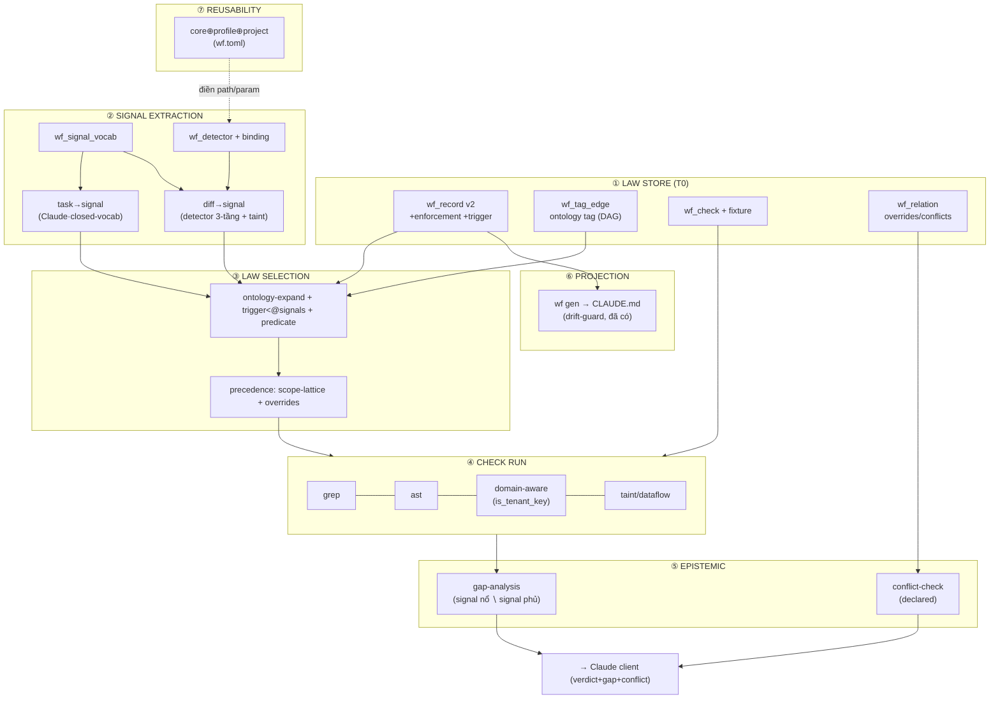
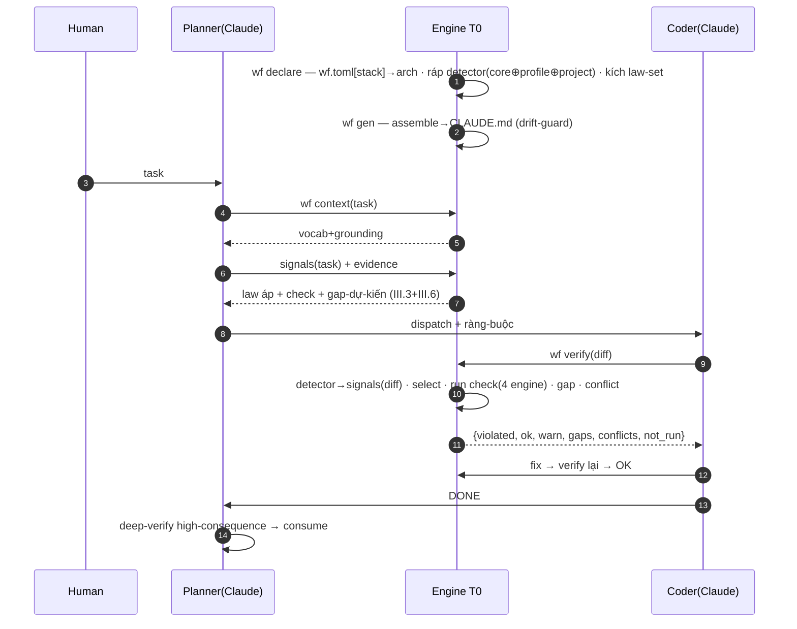

# T0-v2 — GIẢI-PHÁP HOÀN-CHỈNH (Enforceable-Law Engine)

> Thiết-kế TRỌN-VẸN, đầy-đủ, để build một lượt (không lát-mỏng). Bao mọi thành-phần: schema · ontology · signal-extraction · law-selection · check (4 engine) · gap · conflict · reusability · pipeline · corpus 15 luật · chương-trình build.
> Build **trên** hạ-tầng đã có (`constitution/*`, `wf.toml` binding, drift-guard, 10 guard bash), không đập.
> **Ngày:** 2026-07-14.

---

## PHẦN I — KIẾN-TRÚC TỔNG-THỂ (bức tranh đầy-đủ)



**5 verb engine (surface hoàn-chỉnh):** `wf declare` · `wf context` · `wf verify` · `wf gen` · `wf gaps`.

---

## PHẦN II — DATA MODEL (schema đầy-đủ, DDL-level)

Trên `constitution/schema.sql` + `db/schema/001_core.sql` đã có. Thêm/sửa:

```sql
-- ✏️ wf_record: +2 cột (giữ nguyên phần cũ)
ALTER TABLE wf_record
  ADD COLUMN enforcement text NOT NULL DEFAULT 'advisory'    -- enforceable|advisory
    CHECK (enforcement IN ('enforceable','advisory')),
  ADD COLUMN trigger     jsonb;                              -- {all:[],any:[],not:[]} predicate
-- (precedence int GIỮ tạm để tương-thích; deprecate bằng scope-lattice + overrides — xem §III.5)

-- 🆕 wf_tag_vocab: từ-vựng signal ĐÓNG (Claude chỉ được tick, engine validate)
CREATE TABLE wf_tag_vocab (
  tag         text PRIMARY KEY,           -- 'data-path','money-path','new-route'...
  scope       text NOT NULL DEFAULT 'core',
  project_id  uuid REFERENCES project(project_id),
  definition  text NOT NULL,              -- nghĩa để Claude phân-loại
  canonical   text REFERENCES wf_tag_vocab(tag)   -- synonym → canonical (NULL nếu tự-canonical)
);

-- 🆕 wf_tag_edge: ONTOLOGY tag (DAG bao-hàm; money-path is-a data-path)
CREATE TABLE wf_tag_edge (
  child   text NOT NULL REFERENCES wf_tag_vocab(tag),
  parent  text NOT NULL REFERENCES wf_tag_vocab(tag),
  PRIMARY KEY (child, parent)
  -- guard: cấm chu-trình (kiểm lúc insert bằng reachability)
);

-- 🆕 wf_check: 1 luật enforceable → N check (openapi-drift cần 3)
CREATE TABLE wf_check (
  check_id      uuid PRIMARY KEY DEFAULT gen_random_uuid(),
  record_id     uuid NOT NULL REFERENCES wf_record(record_id) ON DELETE CASCADE,
  engine        text NOT NULL,   -- grep|ast|domain|taint|regen-diff|script
  spec          text NOT NULL,   -- pattern/query/rule
  polarity      text NOT NULL,   -- presence-bad|absence-bad|drift|gap
  check_scope   text NOT NULL,   -- diff|changed-files|repo|migrations|commits
  severity      text NOT NULL,   -- block|warn|info
  binding_ref   text,            -- key vào wf.toml [detectors]/[checks]
  born_from_ref text,
  CONSTRAINT wf_check_engine_ck CHECK (engine IN ('grep','ast','domain','taint','regen-diff','script'))
);

-- 🆕 wf_check_fixture: check phải TỰ-CÓ-TEST (chống kêu-sói)
CREATE TABLE wf_check_fixture (
  fixture_id  uuid PRIMARY KEY DEFAULT gen_random_uuid(),
  check_id    uuid NOT NULL REFERENCES wf_check(check_id) ON DELETE CASCADE,
  kind        text NOT NULL CHECK (kind IN ('must-violate','must-pass')),
  sample      text NOT NULL
);

-- 🆕 wf_detector: signal ← diff. 3-tầng qua scope (core signal / profile matcher / project binding)
CREATE TABLE wf_detector (
  detector_id uuid PRIMARY KEY DEFAULT gen_random_uuid(),
  signal      text NOT NULL REFERENCES wf_tag_vocab(tag),
  scope       text NOT NULL DEFAULT 'core',      -- core|profile|project
  project_id  uuid REFERENCES project(project_id),
  engine      text NOT NULL,                     -- grep|ast|domain|taint
  matcher     jsonb,                             -- pattern/AST-query/table-set-ref
  path_glob   text[],                            -- BINDING (project); NULL ở core
  fixtures    jsonb,                             -- must-fire / must-not-fire
  born_from_ref text
);

-- wf_relation: dùng lại; thêm rel_type 'overrides' (§III.5)
```

**RLS:** `wf_check`/`wf_detector`/`wf_tag_*` theo mẫu `002_rls.sql` — `project_id = GUC OR NULL` (core dùng chung). Tái-dùng nguyên pattern.

---

## PHẦN III — THUẬT-TOÁN (đầy-đủ)

### III.1 · Signal từ TASK (Claude, planning) — pipeline 5 bước
`engine.context(task)` → gửi Claude `{signal_vocab đóng + grounding_hints (engine grep sẵn)}` → Claude đọc code, tick signal + evidence + **xử-hết-vocab** (`considered_but_excluded`) → trả JSON schema-forced → **engine validate** (tag∈vocab · có evidence · phủ-hết-vocab · grep xác-nhận file) → fail thì bắt retry. Đo bằng **extraction-fixture** (recall/precision signal).

### III.2 · Signal từ DIFF (detector, verify) — CỨNG
```
signals = ∅
cho mỗi file f trong diff:
  cho mỗi detector d (path_glob khớp f):
    nếu engine(d) tìm matcher(d) trong hunk-thêm(f): signals += d.signal
return signals ∪ arch(project)
```
Detector 3 tầng chính-xác: **grep → ast → domain-aware(is_tenant_key) → taint** (§III.4). Detector có fixture (must-fire/not-fire) → testable.

### III.3 · Chọn luật (ontology + subset + predicate)
```sql
-- bung signal lên tổ-tiên ontology (money-path → +data-path)
WITH expanded AS (
  SELECT DISTINCT t FROM (
    SELECT unnest(:signals) AS t
    UNION
    SELECT parent FROM wf_tag_edge WHERE child = ANY(:signals)   -- + đệ-quy nếu DAG sâu
  ) x )
SELECT r.key, r.body_md, r.trigger, r.enforcement
FROM wf_record r
WHERE r.status='active'
  AND (
     -- dạng phẳng (array): trigger là tập-con của signals-đã-bung
     (r.trigger ? 'tags' AND (r.trigger->'tags') <@ to_jsonb((SELECT array_agg(t) FROM expanded)))
     -- dạng predicate (all/any/not): evaluate bằng eval_predicate()
     OR eval_predicate(r.trigger, (SELECT array_agg(t) FROM expanded))
  );
```
`eval_predicate(trigger, facts)` = evaluator nhỏ (all=⊆, any=∩≠∅, not=∌, threshold=so-số). Deterministic.

### III.4 · Chạy check (4 engine)
| engine | dùng cho | ví-dụ |
|---|---|---|
| `grep` | pattern chuỗi rẻ | `-- ROLLBACK` header |
| `ast` (tree-sitter) | cú-pháp chính-xác | `@Get(` là decorator thật |
| `domain` | neo schema | "đụng bảng có `is_tenant_key`" (query T3) |
| `taint` | dataflow/must-dominate | "mọi query bị `withTenant()` thống-trị" |

Domain-aware lấy tập bảng tenant từ schema sống:
```sql
SELECT DISTINCT t.name FROM db_table t JOIN db_column c ON c.table_id=t.table_id
WHERE c.is_tenant_key AND t.project_id=:pid;   -- danh-sách tự cập-nhật
```

### III.5 · Precedence (bỏ int, dùng lattice + overrides + flag)
- **cross-scope:** `project > profile > core` (scope-lattice, tự-động).
- **same-scope đè cụ-thể:** cạnh `wf_relation rel_type='overrides'`.
- **không giải được:** FLAG (M3), KHÔNG auto-pick.

### III.6 · Gap-analysis (epistemic)
```sql
SELECT sig FROM unnest(:diff_signals) sig
EXCEPT
SELECT DISTINCT jsonb_array_elements_text(r.trigger->'tags')
FROM wf_record r JOIN wf_check c ON c.record_id=r.record_id
WHERE r.enforcement='enforceable';
-- → signal nổ nhưng KHÔNG enforceable-check nào phủ → "chưa verify"
```

### III.7 · Conflict-check (declared, rẻ)
```sql
SELECT * FROM wf_relation
WHERE rel_type='conflicts' AND from_record=ANY(:active) AND to_record=ANY(:active);
```

---

## PHẦN IV — PIPELINE (5 verb, flow đầy-đủ)



---

## PHẦN V — REUSABILITY (đầy-đủ, 3 tầng)

| Tầng | Giữ | Nhà |
|---|---|---|
| **core** | signal-name · law-invariant · gap/conflict algo | `wf_*` scope=core |
| **profile** | matcher theo framework (nestjs `@Get`, django `path()`) | `wf_detector`/`wf_check` scope=profile |
| **project** | path_glob · role-name · threshold · homes | `wf.toml` |

`wf.toml` mở-rộng:
```toml
[stack]      profile="nestjs-python-microservices"  arch=["multitenant","frontend","backend-api","has-migrations"]
[detectors]  routes_glob=["apps/*/src/**/*.controller.ts"]  repo_glob=["**/*.repo.ts"]
             migrations_glob=["infra/migrations/V*.sql"]  migration_floor=15  tenant_helper="withTenant"
[checks]     runtime_role_forbid=["icp"]  runtime_role_require=["icp_app"]
```
Project mới = đổi `[stack]/[detectors]/[checks]`; signal + luật + algo **đứng yên**.

---

## PHẦN VI — CORPUS 15 LUẬT → phân-loại đầy-đủ

| Luật (F) | enforcement | check (engine·severity) | nguồn check |
|---|---|---|---|
| single-home (F8) | enforceable | regen-diff ×4 · block | facts/openapi-drift ×3 (có) |
| commit-lint (F10) | enforceable | regex · block | commit-lint (có) |
| anti-orphan (F13) | enforceable | script · warn | parity-ledger (có) |
| dod→tenant-gate (F9) | enforceable | grep→domain→**taint** · block | tenant-route+runtime-role (có)+taint(mới) |
| dod→migration-fwd (F9) | enforceable | grep · block | migration-rollback (có) |
| stop-conditions (F11) | enforceable | static · block | cutover-migrations (có) |
| dod→money-unit (F9) | enforceable | **domain+taint** · block | **MỚI** (amount VND) |
| seed-per-feature (F14) | enforceable | script · warn | **MỚI** |
| verify-depth (F5) | advisory | — | prose (phán-đoán) |
| no-mask (F6) | advisory | — | prose |
| slice-taxonomy (F7) | advisory | — | prose |
| write-through (F12) | advisory | — | prose |
| relay-atomic/lock (F3/F4) | advisory | — | prose |
| prose-deferral (F15) | enforceable | script · warn | parity (chung F13) |
| persona planner/coder (F1/F2) | advisory | — | prose |

→ **8 enforceable** (6 nối guard có + 2 mới) · **7 advisory** (prose+retrieve). Tỉ-lệ đúng thiết-kế.

---

## PHẦN VII — CHƯƠNG-TRÌNH BUILD (làm HẾT, 6 slice song-song-hoá)

> Type-B (single-svc engine) trừ S6 = Type-D (e2e trên diff ICP thật). Build đầy-đủ, không "prove-1-trước".

| Slice | Nội-dung | Type |
|---|---|---|
| **S-T0V2-1 · SCHEMA** | migrate ALTER wf_record + 5 bảng mới (§II) + RLS + tag-vocab/ontology seed | B |
| **S-T0V2-2 · SIGNAL** | `wf_signal_vocab` đầy · detector 3-tầng (§III.2) + binding `[detectors]` · fixture · extraction-contract (§III.1) | B |
| **S-T0V2-3 · SELECT** | ontology-expand + `<@` + `eval_predicate` (§III.3) · precedence lattice+overrides (§III.5) · 15 luật gắn trigger (§VI) | B |
| **S-T0V2-4 · CHECK** | 4 check-runner grep/ast/domain/taint (§III.4) · wire 8 enforceable + fixture · nối 6 guard bash + 2 check mới | B |
| **S-T0V2-5 · EPISTEMIC+PIPE** | gap (§III.6) + conflict (§III.7) · 5 verb `declare/context/verify/gen/gaps` (§IV) · drift-guard tích-hợp | B |
| **S-T0V2-6 · E2E REUSE** | chạy full pipeline trên **diff ICP thật** (tenant-leak · money-unit · migration · drift) · reusability 2-project smoke · đo recall check | **D** |

**Song-song:** S1→(S2,S3 sau S1)→(S4 sau S2+S3)→(S5 sau S4)→S6. Fan-out coder theo slice; planner deep-verify S4/S6 (high-consequence: taint tenant/money).

**Acceptance toàn giải-pháp:** trên 4 diff-lỗi ICP thật, engine (a) bắt đúng ≥ mọi lỗ enforceable, (b) báo gap cho vùng chưa phủ, (c) 0 false-positive trên diff sạch, (d) reusability: đổi `wf.toml` → chạy được trên 1 project thứ-2 (stub) không sửa core.

---

## Chốt
Giải-pháp HOÀN-CHỈNH: **law-store (trigger+ontology) → signal (task+diff, 3-tầng+taint) → select (subset+predicate+precedence) → check (4 engine) → gap+conflict → projection → reusable (core/profile/project)**. Build qua **6 slice** làm hết một lượt, đóng bằng **e2e trên diff ICP thật**. Trên hạ-tầng đã có (constitution+drift-guard+wf.toml+10 guard), không đập.
