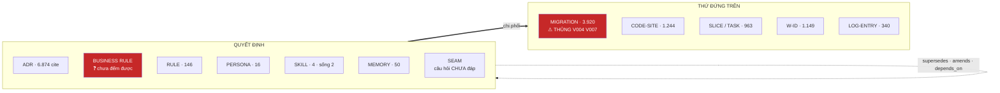
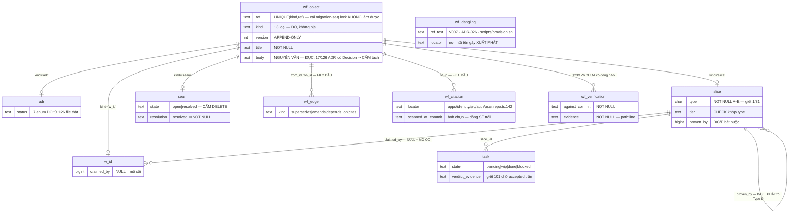
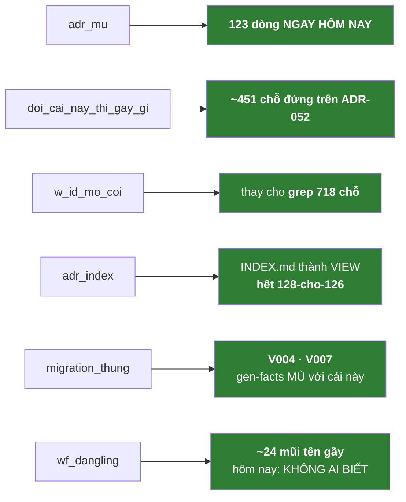

# THIẾT KẾ — ĐƯA CÁC ĐỐI TƯỢNG WORKFLOW VÀO `icp-wf-postgres`

> **v3.** Mọi bảng, mọi cột đều truy được về **một phép đo cụ thể** trên repo này, 2026-07-16.
> §7 = chỗ tôi tự chỉ ra nó còn yếu. §8 = lệnh để bạn tự chạy lại — **đừng tin số của tôi**.

---

## §0. Bệnh của workflow hiện tại — một câu

> **Nó có LUẬT cho mọi thứ, và có KẺ VỠ cho gần như không thứ gì.**

| Luật thành văn | Kẻ vỡ khi luật bị bỏ qua | Kết quả đo được |
|---|---|---|
| *"Migration forward-only, số kế tiếp theo FACTS"* (`§5`) | **FACTS mù với lỗ thủng** | **dãy V001–V079 THỦNG V004, V007** |
| *"Mỗi slice KHAI type+tier"* — **Invariant** (`ICP_WEB_PLAN:66`) | không ai | **1/31 = 3%** |
| *"ADR append-only"* (`§9`) | không ai | **13 kiểu viết `Status`** · **64/126** không đọc nổi |
| *"Grep/đọc code trước khi khẳng định"* (`§3`) | **grep nói dối im lặng** | tôi dính **4 lần trong một buổi** |
| `dispatch` 5 lớp (`§13`) | **coder tắc việc ngay** | **20/20 = 100%** |

**Thang đo, sáu điểm, cùng một người, cùng một tuần:**

| | dispatch | commit | report | verdict *(nội dung)* | slice type | ADR đối chiếu |
|---|---|---|---|---|---|---|
| **Tuân thủ** | **100%** | **95%** | 31% | 20% | **3%** | **2,4%** |
| **Có kẻ vỡ?** | coder tắc | máy chặn | không | cổng chỉ đo hình thức | không | không |

Luật viết hay hay dở **không đổi được hàng số này**. Chỉ **kẻ-vỡ** đổi được.
**Và `FOREIGN KEY` là kẻ-vỡ hoàn hảo: không mệt, không quên, không bấm-cho-xong.**

---

## §1. DB này để làm gì

**Để một đối tượng có DANH TÍNH THẬT — thứ mà tên file không bao giờ là.**

Hôm nay danh tính là **một chuỗi ký tự trong tên file**. Chuỗi ký tự không có luật. Hậu quả **đã đo, đang tồn tại ngay lúc này**:

### ~24 mũi tên trỏ vào hư vô — không một cái nào có ai biết

| Loại | Gãy | Cụ thể |
|---|---|---|
| **ADR** | **3** | `ADR-026` · `ADR-030` — **nằm trong chính `docs/decisions/INDEX.md`**; `ADR-131` — trong `docs/MASTER_BACKLOG.md` |
| **MIGRATION** | **2** | `V004` · `V007` — **chưa từng tồn tại trong git**, mà **code sống đang viện dẫn chúng làm lý do** |
| **SCRIPT** | **9** | `provision.sh` · `demo.sh` · `verify-agentfix.sh` · `seed_cli.py` · `export_openapi.py` … và `backfill_vespa_tenant.py` — **file CÓ THẬT nhưng ở `apps/mcp/scripts/`, đường dẫn SAI** |
| **MEMORY** | **~10** | `memory mock-only` → thật là `mock-only-misses-container-bugs` · `coder-classifier-block` → `coder-classifier-blocks-shared-writes` — **cụt, không phải định danh** |

> Tôi tìm ra chúng **do tình cờ**, sau khi phải sửa một con bug locale trong **chính lệnh grep của mình**. Không có cơ chế nào phát hiện. Chúng đã nằm đó **không biết bao lâu**.

### Ca nặng nhất: `V007`

```
apps/identity/src/auth/user.repo.ts:142
  "users.phone is NOT UNIQUE (V007 — shared land-lines), so this returns ALL matches"
```

Đây **không phải chú thích cho vui** — nó **biện minh cho hành vi thật của code đang chạy**. Và **`V007` chưa từng tồn tại**. Nên hoặc lý do sai, hoặc số sai. **Không ai biết là cái nào.**

### Và `FACTS` — cỗ máy sự thật — KHÔNG THỂ nhìn thấy

```
gen-facts.sh:26  →  echo "- highest: V$(... | sort -n | tail -1)"
FACTS.md:81      →  "- highest: V079"          # 77 file. Thiếu V004, V007. Vô hình.
```

`§9` phong `FACTS.md` làm **nhà duy nhất của "hiện trạng code/DB"**. Nó tính `max`, **không đếm**. `§5` bảo *"số kế tiếp theo FACTS"* → đọc FACTS → V079 → lấy V080. **Luật chạy đúng. Lỗ thủng vô hình vĩnh viễn.**

### Hệ đã tự thú rồi

`scripts/wf-lock:69` liệt kê tài nguyên phải khoá:
```
<res> examples:  git · dev-db · docker · migration-seq · file:<path>
```
**`migration-seq` — một cái KHOÁ, chỉ để hai người không cùng lấy số `V012`.** Hệ **đã biết** tên file không giữ nổi số, phải mượn khoá Redis. Nhưng khoá chỉ chặn lúc **đua** — không chặn gõ trùng, bỏ số, nhảy số. Và `wf-lock:8` tự nhận nó **advisory**: *"Redis không thể chặn coder QUÊN khoá"*.

> **`UNIQUE(kind, ref)` làm được cái `migration-seq` lock không bao giờ làm được: bất-khả-trùng ở MỌI lúc.** `UNIQUE` không quên được.

---

## §2. Ba nguyên tắc — rút từ số đo

### 2.1 Xương vào DB. Thịt để nguyên văn.

Mọi lỗi đo được đều là lỗi **bộ xương** (danh tính · trạng thái · quan hệ), **không cái nào là lỗi văn xuôi**.

⟹ **`body` là markdown ĐỤC.** Không `statement`, không `rationale`.
Bản v1 để `statement NOT NULL` (ánh xạ trường `Decision`) — **từ chối 109/126 ADR**, vì chỉ **17/126** ADR có trường đó (18+ tên trường cùng tồn tại: `Context` 48 · `Refs` 37 ≠ `Reference` 19 · `Breaking` 7 ≠ `breaking` 2 · `Consequence` 3 ≠ `Consequences` 3).

### 2.2 Đừng đẻ CỘT. Đẻ KẺ ĂN.

**Phép đo quan trọng nhất trong cả ngày:**

| Kho | Cấu trúc | Ràng buộc? |
|---|---|---|
| **MEMORY** · 70 file | `name`+`description`+`metadata` = **70/70** · `type` sạch 3 giá trị · **0/163 `[[link]]` gãy** | **KHÔNG CÓ GÌ** |
| **ADR** · 126 | 18+ tên trường · **17/126** có `Decision` | không |
| **SLICE** · 118 | `Mục tiêu`(11) vs `GOAL`(8) · `TASKS`(10) vs `§T`(10) vs `T`(8) | không |

Cùng một Claude viết cả ba. Format cả ba đều nằm sẵn trong context mỗi phiên. **Memory không có CHECK, không NOT NULL, không database — mà nó hoàn hảo.**

> **`description` của memory BỊ `MEMORY.md` ĂN** để dựng index → thiếu nó memory **vô hình** → hỏng **thấy được ngay** ⟹ **100%**.
> **`name` bị `[[link]]` ĂN** → thiếu nó link chết ⟹ **100%**.
> **Trường của ADR KHÔNG AI ĂN** → viết hay không, không gì xảy ra ⟹ **17/126**.

⟹ Cấu trúc **mọc dần bằng kẻ ăn**, không ép một lần. Muốn ADR có `statement`? Cột **nullable** + cho `icp-wf load` **ăn** nó + view `adr_thieu_statement`. Cột rỗng ⟹ kẻ ăn **hỏng thấy được** ⟹ tự được điền.

### 2.3 Tiêu chí vào `wf_object`: **cái gì bị gọi bằng TÊN**

Việc **duy nhất** của `wf_object` là **làm đích cho FK**. Nên tiêu chí không phải "nó có hỏng không" mà là **"có thứ gì gọi nó bằng tên không"**.

| Loại | Bị gọi tên | Đã đo gãy? |
|---|---|---|
| **ADR** | **6.874** | ✅ **3 gãy** |
| **MIGRATION `V0NN`** | **3.920** | ✅ **2 gãy** *(V004, V007)* |
| CODE-SITE `path:line` | 1.244 | *(mục — nằm ở `wf_citation`, không phải object)* |
| **W-ID** | 1.149 | ❌ chưa đo |
| **SLICE / TASK** | 963 | ❌ chưa đo |
| **LOG_CATALOG entry** | 340 | ❌ chưa đo |
| COMMIT sha | 303 | *(git là nhà — không vào DB)* |
| **SCRIPT** | **253** | ✅ **9 gãy** |
| **RULE — `CLAUDE.md §N`** | 146 | ❌ chưa đo |
| **MEMORY** | 50 | ✅ **~10 cụt/mờ** |
| **PERSONA — `ICP_WEB_PLAN §N`** | 16 | ❌ chưa đo |

> **Đính chính quan trọng về memory:** câu *"memory hoàn hảo, 0/163 gãy"* chỉ đúng **BÊN TRONG** thư mục memory — vì `[[ ]]` là **định danh**.
> **Từ ngoài vào**, slice gọi memory bằng **văn xuôi cụt** (`docs/slices/S-STORE-01.md:23`: *"FE close = full web suite (**memory fe-tasks-run-full-web-suite**)"*), và **không gì kiểm cả**. Người đoán được; máy thì không; hai memory cùng tiền tố là hỏng.
> ⟹ **Memory PHẢI có danh tính trong `wf_object`** — không phải để đổi cách nó hoạt động (frontmatter 70/70 giữ nguyên), mà vì **thứ ở ngoài đang trỏ vào nó bằng mũi tên cháo**.

---

## §3. Sơ đồ

### 3.1 Mô hình gốc



### 3.2 ERD



### 3.3 Sáu kẻ ăn — đây mới là SẢN PHẨM



---

## §4. Schema

### 4.1 Xương — danh tính

```sql
CREATE TABLE wf_object (
  id      bigserial PRIMARY KEY,
  ref     text NOT NULL,
  kind    text NOT NULL CHECK (kind IN (
            -- 7 loại đã chốt
            'adr','business_rule','rule','skill','slice','seam','w_id',
            -- bổ sung, mỗi cái có số đo (§2.3)
            'migration','script','memory','log_entry','persona','task')),
  version int  NOT NULL DEFAULT 1 CHECK (version > 0),
  title   text NOT NULL CHECK (btrim(title) <> ''),
  body    text NOT NULL,          -- ⚠ NGUYÊN VĂN markdown. ĐỤC. Không tách.
  created_at timestamptz NOT NULL DEFAULT now(),
  created_by text NOT NULL,
  UNIQUE (kind, ref, version)     -- ⚠ cái mà `migration-seq` lock không bao giờ làm được
);
```

> **Về `CHECK` định dạng `ref`:** bản v2 tôi viết `ref ~ '^(ADR|BR|...)-[A-Za-z0-9§._-]+$'` và tuyên nó *"giết 3 quy ước đặt tên"*. **Tôi đã thử: nó cho qua TẤT** — `ADR-05-02`, `ADR-9999`, `ADR-abc` — vì dấu `-` nằm trong lớp ký tự. **Regex đó vô dụng.**
> Bài học: **`CHECK` không tự nghĩ ra luật; nó chỉ ép được luật bạn đã QUYẾT.** Muốn nó có tác dụng, phải trả lời trước: **`ADR-05-02` hợp lệ hay sai?** Nếu sai → `CHECK (kind<>'adr' OR ref ~ '^ADR-[0-9]{3}$')` và file đó phải đổi tên. Nếu hợp lệ (nó là *"quyết định số 2 của slice S-05"* — một hệ đánh số khác) → cho nó tiền tố riêng `BR-S05-02` để **thôi va hình** với `ADR-052`. **Đây là câu hỏi của human, không phải của máy.**

### 4.2 Chi tiết theo loại — chỉ cột CÓ KẺ ĂN

```sql
CREATE TABLE adr (
  object_id bigint PRIMARY KEY REFERENCES wf_object(id),
  status text NOT NULL CHECK (status IN            -- 7 giá trị ĐO từ 126 file thật
    ('draft','proposed','accepted','locked','partially_superseded','superseded','retired'))
);

CREATE TABLE slice (
  object_id bigint PRIMARY KEY REFERENCES wf_object(id),
  type  char(1) NOT NULL CHECK (type IN ('A','B','C','D','E')),   -- ← giết 1/31
  tier  text NOT NULL,
  phase text NOT NULL CHECK (phase IN ('active','closing','closed')),
  proven_by bigint REFERENCES slice(object_id),
  CHECK (type IN ('A','D') OR proven_by IS NOT NULL),              -- anti-orphan
  CHECK ((type='A' AND tier='full-e2e') OR (type='B' AND tier='isolation')
      OR (type='C' AND tier='unit+consumer-contract')
      OR (type='D' AND tier='cross-unit-e2e-edge-that')
      OR (type='E' AND tier='forward+rollback+parity'))
);

CREATE TABLE seam (
  object_id bigint PRIMARY KEY REFERENCES wf_object(id),
  state text NOT NULL CHECK (state IN ('open','resolved')),
  resolution text,
  CHECK (state <> 'resolved' OR btrim(coalesce(resolution,'')) <> '')   -- resolve ≠ XOÁ
);

CREATE TABLE w_id (
  object_id bigint PRIMARY KEY REFERENCES wf_object(id),
  claimed_by bigint REFERENCES slice(object_id),      -- NULL = MỒ CÔI
  done_at timestamptz
);

CREATE TABLE task (
  id bigserial PRIMARY KEY,
  slice_id bigint NOT NULL REFERENCES slice(object_id),
  ref text NOT NULL,
  state text NOT NULL CHECK (state IN ('pending','wip','done','blocked','needs-decision')),
  commit_sha text, verdict text, verdict_evidence text,
  CHECK (state <> 'done' OR commit_sha IS NOT NULL),
  CHECK (verdict IS NULL OR btrim(coalesce(verdict_evidence,'')) <> ''),
  UNIQUE (slice_id, ref)
);
```

### 4.3 Quan hệ — hai loại KHÁC nhau

```sql
-- (a) object ↔ object : FK HAI ĐẦU ⇒ ADR-026/030/131 không thể tồn tại
CREATE TABLE wf_edge (
  from_id bigint NOT NULL REFERENCES wf_object(id),
  to_id   bigint NOT NULL REFERENCES wf_object(id),
  kind text NOT NULL CHECK (kind IN
    ('supersedes','partially_supersedes','amends','depends_on','conflicts','cites')),
  PRIMARY KEY (from_id, to_id, kind), CHECK (from_id <> to_id)
);

-- (b) CODE → object : FK MỘT ĐẦU. Nguồn là file:line, KHÔNG phải thực thể.
CREATE TABLE wf_citation (
  locator text NOT NULL,                             -- 'apps/identity/.../user.repo.ts:142'
  to_id   bigint NOT NULL REFERENCES wf_object(id),  -- chỉ ĐÍCH cần danh tính
  relation text NOT NULL CHECK (relation IN ('implements','cites','tests')),
  scanned_at_commit text NOT NULL,
  PRIMARY KEY (locator, to_id)
);

-- (c) scan thấy TÊN nhưng tên đó KHÔNG CÓ THẬT — biến FK thành MÁY DÒ
CREATE TABLE wf_dangling (
  locator  text NOT NULL,          -- 'apps/identity/src/auth/user.repo.ts:142'
  ref_text text NOT NULL,          -- 'V007'
  scanned_at_commit text NOT NULL,
  PRIMARY KEY (locator, ref_text)
);
```

> **Cơ chế:** scan quét code thấy `V007` → định `INSERT wf_citation` → FK **không tìm thấy dòng nào** → thay vì chết im lặng, scan ghi vào **`wf_dangling`**.
> **Nội dung bảng này NGAY HÔM NAY: ~24 dòng** — 3 ADR + 2 migration + 9 script + ~10 memory. **Toàn bộ đang vô hình.**

### 4.4 Đối chiếu — chỗ giết 123/126

```sql
CREATE TABLE wf_verification (
  object_id bigint NOT NULL REFERENCES wf_object(id),
  at timestamptz NOT NULL DEFAULT now(),
  against_commit text NOT NULL,
  verdict text NOT NULL CHECK (verdict IN ('matches','drifted')),
  evidence text NOT NULL CHECK (btrim(evidence) <> ''),   -- path:line
  PRIMARY KEY (object_id, at)
);
```
> Là **bảng** chứ không phải 2 cột — vì **`ADR-005` chứng minh lịch sử đối chiếu đáng giữ**: nó ghi *"verified code 2026-06-09"* + drift Gemini→OpenAI + dẫn `speech.py:54,140,190`. **ADR-005 là 1 trong 3 cái duy nhất từng được soi.** Đè lên là mất.

### 4.5 Cổng SuperAdmin

```sql
CREATE TABLE wf_approval (
  object_id bigint PRIMARY KEY REFERENCES wf_object(id),
  approved_by text NOT NULL, approved_at timestamptz NOT NULL DEFAULT now(), note text
);
CREATE TABLE wf_proposal (
  id bigserial PRIMARY KEY, ref text NOT NULL, kind text NOT NULL,
  title text NOT NULL, body text NOT NULL, rationale text NOT NULL,
  proposed_by text NOT NULL, proposed_at timestamptz NOT NULL DEFAULT now(),
  state text NOT NULL DEFAULT 'pending' CHECK (state IN ('pending','accepted','rejected'))
);
CREATE TABLE wf_audit (
  id bigserial PRIMARY KEY, at timestamptz NOT NULL DEFAULT now(),
  actor text NOT NULL, action text NOT NULL, ref text, detail jsonb
);

CREATE VIEW wf_live AS        -- Claude CHỈ thấy view này
  SELECT DISTINCT ON (o.kind, o.ref) o.* FROM wf_object o
  JOIN wf_approval a ON a.object_id = o.id ORDER BY o.kind, o.ref, o.version DESC;
```

```sql
CREATE ROLE icp_wf_reader LOGIN PASSWORD '…';    -- Claude
GRANT SELECT ON wf_live, adr, slice, seam, w_id, task,
                wf_edge, wf_citation, wf_dangling, wf_verification TO icp_wf_reader;
GRANT INSERT ON wf_proposal, wf_audit TO icp_wf_reader;
-- KHÔNG cấp gì trên wf_object / wf_approval

CREATE ROLE icp_wf_admin LOGIN PASSWORD '…';     -- SuperAdmin = human
GRANT ALL ON ALL TABLES IN SCHEMA public TO icp_wf_admin;
```

> ⚠️ **Cổng chỉ có giá trị khi HIẾM.** `relay consume --verdict` là cổng **cứng nhất** trong hệ (`exit 2`, không ai né nổi) và nó mua được **100% chữ ký, 20% nội dung** — **101 lần là chữ `accepted` trần**. Gate nhiều = con dấu cao su. ⟹ gate **luật** (hiếm), **không** gate memory/slice/relay-state (thường xuyên).

---

## §5. Kẻ ăn — nguyên tắc §2.2, và đây mới là SẢN PHẨM

```sql
-- 123 dòng NGAY HÔM NAY. Từ vô hình → một dòng, không trốn được.
CREATE VIEW adr_mu AS
SELECT o.ref, o.title, v.lan_cuoi FROM wf_object o JOIN adr a ON a.object_id=o.id
LEFT JOIN LATERAL (SELECT max(at) lan_cuoi FROM wf_verification WHERE object_id=o.id) v ON true
WHERE a.status IN ('accepted','locked')
  AND (v.lan_cuoi IS NULL OR v.lan_cuoi < now() - interval '90 days');

-- "đổi cái này thì gãy gì?" — ~451 chỗ cho ADR-052. Hôm nay: KHÔNG AI BIẾT.
CREATE VIEW doi_cai_nay_thi_gay_gi AS
SELECT o.kind, o.ref, c.locator AS cho_dung_tren, c.relation
FROM wf_object o JOIN wf_citation c ON c.to_id=o.id;

-- thay cho grep 718 chỗ
CREATE VIEW w_id_mo_coi AS
SELECT o.ref, o.title FROM wf_object o JOIN w_id w ON w.object_id=o.id
WHERE w.claimed_by IS NULL AND w.done_at IS NULL;

-- INDEX.md thành VIEW ⇒ hết 128-cho-126, không còn bản thứ hai để mà lệch
CREATE VIEW adr_index AS
SELECT o.ref, o.title, a.status FROM wf_object o JOIN adr a ON a.object_id=o.id ORDER BY o.ref;

-- ⚠ UNIQUE chống TRÙNG, KHÔNG chống THỦNG. Cần kẻ ăn riêng.
--   Hôm nay trả về: V004, V007 — thứ mà gen-facts.sh MÙ hoàn toàn.
CREATE VIEW migration_thung AS
SELECT 'V'||lpad(s.n::text,3,'0') AS thieu
FROM generate_series(1,(SELECT max(substring(ref from 'V([0-9]+)')::int)
                        FROM wf_object WHERE kind='migration')) s(n)
WHERE NOT EXISTS (SELECT 1 FROM wf_object
                  WHERE kind='migration' AND ref='V'||lpad(s.n::text,3,'0'));
```

---

## §6. Cái KHÔNG vào DB

| | Vì sao |
|---|---|
| **COMMIT** | **git ĐÃ là sổ danh tính**, và sha bất-khả-trùng thật. Vào DB = **nhà thứ hai** ⟹ phá `§9` |
| **CODE-SITE** *(thực thể)* | `path:line` **mục** khi code đổi ⟹ chỉ là **ảnh chụp** trong `wf_citation.locator` |
| **FACTS · PARITY · CONTRACT** | máy sinh **từ CODE**. Nhà là code (`§9`) |
| **relay state** *(slot/macro)* | ~2000 lượt ghi. Redis đúng. Cổng-duyệt vào đây = hàng nghìn lần bấm yes |
| **Cách memory HOẠT ĐỘNG** | frontmatter 70/70 hoàn hảo — **giữ nguyên**. Chỉ đăng ký **danh tính** của nó, vì thứ bên ngoài trỏ vào bằng tên cụt |

Cùng một tiêu chí: **thứ gì đã có danh tính thật ở nhà khác thì đừng kéo vào.**

---

## §7. Chỗ còn YẾU — tôi tự chỉ

**(a) Ba loại chưa đo có gãy hay không:** `w_id` (1.149 lần gọi) · `slice` (963) · `log_entry` (340) · `rule §N` (146). ADR gãy 3, migration gãy 2, script gãy 9, memory cụt ~10 — **bốn loại kia tôi KHÔNG BIẾT**. Con số ~24 chỉ là **phần tôi tình cờ nhìn thấy**.

**(b) `business_rule` chưa đếm được có bao nhiêu.** Mới 1 tang chứng: `ADR-05-02` — *"Cart price freeze tại add-time"*, status `Locked`, gốc *"D-S05-02 **LAW**"* — một **luật nghiệp vụ** bị nhét vào thư mục ADR với **số tự chế** và **status tự chế**, vì `§9` chỉ mở một cửa. Luật nghiệp vụ thật rải trong ruột slice, trong code, trong `CHECK` của DB product. **Chưa đo thì thiết kế là bịa.**

**(c) Mọi enum ngoài `status` đều CHƯA ĐO.** `relation` · `tier` · `wf_edge.kind` · `phase` — **tôi bịa**. `status` tôi cũng đã bịa một lần (v1: `proposed|accepted|superseded|retired`) và bị dữ liệu bác — thực tế có `Locked`, `Draft`, `Partially Superseded`. **Phải quét corpus từng cái.**

**(d) `CHECK` giết cái RỖNG, không giết cái DỐI.** `verdict_evidence <> ''` ⟹ sẽ có người gõ `'x'`. Bài học từ **101 chữ `accepted` trần**: **cổng chỉ mua được cái nó ĐO.** Áp cho chính thiết kế này.

**(e) `CLAUDE.md` không lấy luật từ DB được.** Nền tảng: **static + `@import`, cấm thực thi**. Hook `SessionStart` chặn ở **10.000 ký tự** — `CLAUDE.md` là **20.893**, skill planner **25.426**. Thứ tự hook↔`@import` **không xác định** (race).
⟹ Đường duy nhất: **sinh file từ DB lúc COMMIT** (như `gen-facts.sh`) rồi `@import` ⟹ **DB thống nhất được, KHÔNG giấu được.**
⟹ **Skill thì ngược lại — DB thắng:** slash command chạy `` !`script` ``, harness ép **trước khi nội dung tới Claude**, không cap 10k ⟹ **36 KB doctrine lấy thẳng từ DB được**.

**(f) Migrate không tự động hoàn toàn.** `ref`/`title`/`body` máy tách được. Nhưng `status` chỉ đọc được **62/126**, và `slice.type` thì **30/31 KHÔNG TỒN TẠI** để mà migrate — phải có người **quyết định** từng slice thuộc Type gì. Việc thật, không né được.

**(g) `wf_object` gom một bảng — chưa chắc đúng.** Lý do: `wf_edge` cần FK hai đầu bắc qua nhiều loại (đã tìm được 1 ca thật: `ADR-052:11` trỏ ngược vào `CLAUDE.md §5`). **Một ca chưa đủ để chốt.** Nếu thực tế chỉ ADR làm đích, tách bảng riêng chặt hơn.

---

## §8. Tự chạy lại — đừng tin số của tôi

```bash
# ⚠ LC_ALL=C BẮT BUỘC. grep/comm im lặng trả rỗng hoặc lỗi sort 4 LẦN hôm nay vì locale.
#   "không tìm thấy" và "không đọc nổi" trông Y HỆT NHAU.
#   Đó là con bug nền của cả hệ — và là lý do sâu nhất khiến FOREIGN KEY đáng giá:
#   NÓ KHÔNG CÓ CHẾ ĐỘ IM LẶNG.

# ── ADR trỏ hư vô → ADR-026, ADR-030, ADR-131
ls docs/decisions/ADR-*.md | grep -oE 'ADR-[0-9]+' | LC_ALL=C sort -u > /tmp/have.txt
grep -rhoE 'ADR-[0-9]{3}' --include='*.md' --include='*.ts' --include='*.py' --include='*.sql' . \
  2>/dev/null | grep -v node_modules | LC_ALL=C sort -u > /tmp/cited.txt
LC_ALL=C comm -13 /tmp/have.txt /tmp/cited.txt

# ── MIGRATION: dãy THỦNG → V004, V007
ls infra/migrations/V*.sql | grep -oE 'V[0-9]{3}' | sort -u | sed 's/V//' \
 | awk 'NR==1{p=$1+0} {c=$1+0; while(p+1<c){p++; printf "THIEU: V%03d\n",p} p=c} END{printf "cao nhat V%03d, tong %d\n",p,NR}'
git log --all --oneline --diff-filter=D -- 'infra/migrations/V004*' 'infra/migrations/V007*'   # → rỗng: CHƯA TỪNG tồn tại
grep -n 'V007' apps/identity/src/auth/user.repo.ts        # → code sống viện dẫn nó
grep -n 'highest' docs/FACTS.md                            # → "highest: V079" — MÙ với lỗ thủng

# ── SCRIPT trỏ hư vô → 9 cái
LC_ALL=C bash -c 'grep -rhoE "scripts/[a-z0-9_-]+\.(sh|py|mjs|ts)" --include="*.md" docs/ CLAUDE.md .claude/ | sort -u > /tmp/cs.txt
  ls scripts/ | sed "s|^|scripts/|" | sort > /tmp/hs.txt; comm -23 /tmp/cs.txt /tmp/hs.txt'

# ── MEMORY bị gọi CỤT từ ngoài
LC_ALL=C bash -c 'grep -rhoE "memory [a-z0-9-]{6,}" --include="*.md" docs/ CLAUDE.md | sed "s/^memory //" | sort -u > /tmp/cm.txt
  ls ~/.claude/projects/-home-hai-soft-projects-icpp-sicp/memory/*.md | xargs -n1 basename | sed "s/\.md$//" | sort > /tmp/hm.txt
  comm -23 /tmp/cm.txt /tmp/hm.txt'

# ── Số lần bị gọi tên (tiêu chí vào wf_object)
grep -rhoE 'ADR-[0-9]{3}'  --include='*.md' --include='*.ts' --include='*.py' --include='*.sql' --include='*.sh' . | grep -v node_modules | wc -l   # 6874
grep -rhoE '\bV[0-9]{3}\b' --include='*.md' --include='*.ts' --include='*.py' --include='*.sql' . | grep -v node_modules | wc -l                    # 3920
grep -rhoE 'scripts/[a-z0-9_-]+' --include='*.md' docs/ CLAUDE.md .claude/ | wc -l                                                                  # 253

# ── ADR: 18+ tên trường · chỉ 17/126 có Decision · 64/126 không đọc nổi Status
LC_ALL=C grep -ohE '^\s*-\s*\*\*[A-Za-z /()-]+:?\*\*' docs/decisions/ADR-*.md \
  | sed -E 's/^\s*-\s*\*\*//; s/:?\*\*$//' | sort | uniq -c | sort -rn | head -18
grep -l '^\- \*\*Status:\*\*' docs/decisions/ADR-*.md | wc -l          # → 62 / 126

# ── MEMORY hoàn hảo BÊN TRONG: 70/70 · 0/163
cd ~/.claude/projects/-home-hai-soft-projects-icpp-sicp/memory
LC_ALL=C grep -ohE '^(name|description|metadata):' *.md | sort | uniq -c     # → 70 mỗi cái

# ── 123/126 chưa đối chiếu code · 30/31 slice không khai type
grep -lE 'verified code|Cập nhật triển khai' docs/decisions/ADR-*.md | wc -l   # → 3
grep -lE 'Type-[A-E]' docs/slices/S-*.md | wc -l                               # → 1
```

---

*v3 · 2026-07-16 · đo trên 126 ADR · 118 slice · 70 memory · 77 migration · 1395 commit · dump relay 428 key.*
*v1 bị chính dữ liệu bác 3 lần: enum `status` bịa · thực thể `decision` là cái thùng · `statement NOT NULL` từ chối 109/126.*
*v2 bị bác 1 lần: `CHECK` regex `ref` cho qua TẤT — tôi tự thử mới biết.*
