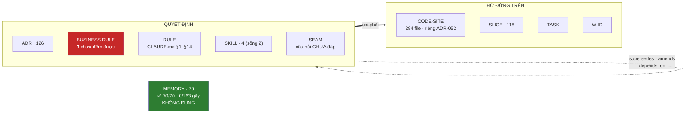
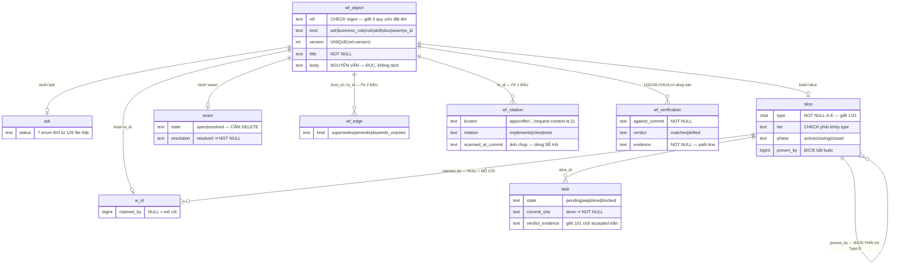
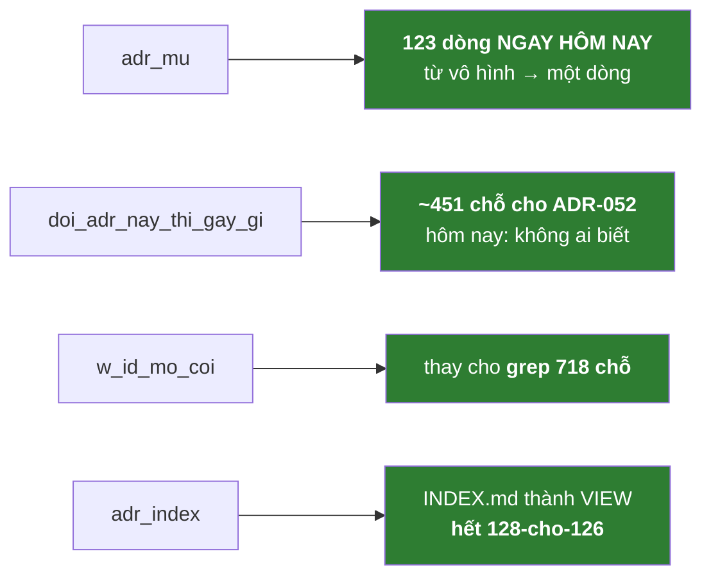

# THIẾT KẾ — ĐƯA CÁC ĐỐI TƯỢNG WORKFLOW VÀO `icp-wf-postgres`

> **Bản v2 — viết lại toàn bộ.** Bản v1 sai ở khung: nó đi cấu trúc hoá **văn xuôi**, trong khi cả mười lỗi đo được đều nằm ở **bộ xương**.
> **Mọi bảng, mọi cột dưới đây đều truy được về một phép đo cụ thể.** Không có gì tôi bịa. §7 là chỗ tôi tự chỉ ra nó còn yếu. §8 = lệnh tự chạy lại.

---

## §0. DB này để làm gì

**Để một quyết định có DANH TÍNH THẬT — thứ mà tên file không bao giờ là.**

Hôm nay danh tính của `ADR-052` là **một chuỗi ký tự trong tên file**. Chuỗi ký tự không có luật, nên:

- **3 quy ước đặt tên cùng sống**: 98× `ADR-NNN.md` · 27× `ADR-NNN-ten-dai.md` · 1× `ADR-NN-NN.md`
- **`ADR-05-02` va hình với `ADR-052`** — hai thứ hoàn toàn khác nhau, cùng tồn tại
- **`ADR-026` · `ADR-030` · `ADR-131` được cite nhưng KHÔNG TỒN TẠI** — hai cái đầu nằm ngay trong `docs/decisions/INDEX.md`

Một dòng trong bảng với `UNIQUE(ref,version)`, và mọi thứ trỏ tới nó **phải trỏ vào một dòng CÓ THẬT** — đó là biến danh tính từ **niềm tin** thành **sự kiện**.

Không phải chỗ chứa. Không phải máy tìm kiếm. **Máy ràng buộc.**

---

## §1. Ba nguyên tắc — rút từ số đo, không từ suy nghĩ

### 1.1 Xương vào DB. Thịt để nguyên văn.

Mười lỗi đo được hôm nay — **không một cái nào là lỗi của văn xuôi**:

| Lỗi | Xương hay thịt? |
|---|---|
| `ADR-026/030/131` trỏ hư vô | **xương** — danh tính |
| 3 quy ước đặt tên | **xương** — danh tính |
| 64/126 không đọc nổi `Status` | **xương** — trạng thái |
| 123/126 chưa đối chiếu code | **xương** — trạng thái kiểm |
| 1/31 slice khai `type` | **xương** |
| 101/126 verdict là chữ trần | **xương** |
| seam `resolve` = XOÁ | **xương** — vòng đời |
| `INDEX.md` liệt 128 cho 126 | **xương** — bản dẫn xuất |

⟹ **`body` là markdown ĐỤC.** Không `statement`, không `rationale`.
Bản v1 để `statement NOT NULL` (ánh xạ từ trường `Decision`) — **nó từ chối 109/126 ADR**, vì chỉ **17/126** ADR có trường đó.

### 1.2 Mỗi cột phải có KẺ ĂN. Đừng ép — hãy cho nó một cái miệng.

Phép đo quan trọng nhất trong cả ngày:

| Kho | Cấu trúc | Có ràng buộc không? |
|---|---|---|
| **MEMORY** — 70 file | `name`+`description`+`metadata` = **70/70** · `type` sạch 3 giá trị · **0/163 link gãy** | **KHÔNG. Không CHECK, không NOT NULL, không DB.** |
| **ADR** — 126 file | 18+ tên trường · **17/126** có `Decision` · `Refs`≠`Reference` · `Breaking`≠`breaking` | không |
| **SLICE** — 118 file | `Mục tiêu`(11) vs `GOAL`(8) · `TASKS`(10) vs `§T`(10) vs `T`(8) | không |

Cùng một Claude viết cả ba. Format của cả ba đều nằm sẵn trong context mỗi phiên. Khác biệt **duy nhất**:

> **`description` của memory BỊ `MEMORY.md` ĂN** để dựng index → thiếu nó memory vô hình → **hỏng thấy được ngay** ⟹ **100%**.
> **Trường của ADR KHÔNG AI ĂN** → viết hay không viết, không gì xảy ra ⟹ **17/126**.

⟹ **Muốn có cấu trúc thì đẻ KẺ ĂN, đừng đẻ CỘT.** Cột nullable + một view lòi ra chỗ trống + một kẻ ăn nó ⟹ cấu trúc **tự mọc**. Đó chính xác là cách memory đạt 70/70.

### 1.3 Chỉ nhận cái ĐANG HỎNG.

| | |
|---|---|
| **ADR · SLICE · SEAM · TASK · W-ID** | vào DB — chúng gãy, có số |
| **MEMORY** | **KHÔNG ĐỤNG** — 70/70, 0/163. Thứ **duy nhất trong hệ đang hoàn hảo**, và nó hoàn hảo nhờ **kẻ ăn**, không nhờ database. Nó không phải thứ cần sửa — **nó là bản mẫu cần copy.** |
| **FACTS · PARITY · CONTRACT** | máy sinh từ CODE — nhà của chúng là code (`§9`). Vào DB = đẻ nhà thứ hai |
| **relay state** (slot/macro) | cao tần, ~2000 lượt ghi. Redis đang đúng. Cổng-duyệt áp vào = hàng nghìn lần bấm yes |

---

## §2. Sơ đồ

### 2.1 Mô hình gốc



### 2.2 ERD



### 2.3 Bốn kẻ ăn — đây mới là sản phẩm



---

## §3. Schema

### 3.1 Xương — danh tính

```sql
CREATE TABLE wf_object (
  id      bigserial PRIMARY KEY,
  ref     text NOT NULL CHECK (ref ~ '^(ADR|BR|RULE|SKILL|SLICE|SEAM|WID)-[A-Za-z0-9§._-]+$'),
  kind    text NOT NULL CHECK (kind IN
            ('adr','business_rule','rule','skill','slice','seam','w_id')),
  version int  NOT NULL DEFAULT 1 CHECK (version > 0),
  title   text NOT NULL CHECK (btrim(title) <> ''),
  body    text NOT NULL,        -- ⚠ NGUYÊN VĂN markdown. ĐỤC. Không tách statement/rationale.
  created_at timestamptz NOT NULL DEFAULT now(),
  created_by text NOT NULL,
  UNIQUE (ref, version)
);
```

### 3.2 Chi tiết theo loại — chỉ cột CÓ KẺ ĂN

```sql
CREATE TABLE adr (
  object_id bigint PRIMARY KEY REFERENCES wf_object(id),
  status text NOT NULL CHECK (status IN
    ('draft','proposed','accepted','locked','partially_superseded','superseded','retired'))
);

CREATE TABLE slice (
  object_id bigint PRIMARY KEY REFERENCES wf_object(id),
  type  char(1) NOT NULL CHECK (type IN ('A','B','C','D','E')),
  tier  text    NOT NULL,
  phase text    NOT NULL CHECK (phase IN ('active','closing','closed')),
  proven_by bigint REFERENCES slice(object_id),
  CHECK (type IN ('A','D') OR proven_by IS NOT NULL),          -- anti-orphan: B/C/E ⇒ Type-D
  CHECK ((type='A' AND tier='full-e2e')
      OR (type='B' AND tier='isolation')
      OR (type='C' AND tier='unit+consumer-contract')
      OR (type='D' AND tier='cross-unit-e2e-edge-that')
      OR (type='E' AND tier='forward+rollback+parity'))
);

CREATE TABLE seam (
  object_id bigint PRIMARY KEY REFERENCES wf_object(id),
  state text NOT NULL CHECK (state IN ('open','resolved')),
  resolution text,
  CHECK (state <> 'resolved' OR btrim(coalesce(resolution,'')) <> '')
);

CREATE TABLE w_id (
  object_id bigint PRIMARY KEY REFERENCES wf_object(id),
  claimed_by bigint REFERENCES slice(object_id),   -- NULL = MỒ CÔI
  done_at    timestamptz
);

CREATE TABLE task (
  id bigserial PRIMARY KEY,
  slice_id bigint NOT NULL REFERENCES slice(object_id),
  ref   text NOT NULL,
  state text NOT NULL CHECK (state IN ('pending','wip','done','blocked','needs-decision')),
  commit_sha text, verdict text, verdict_evidence text,
  CHECK (state <> 'done' OR commit_sha IS NOT NULL),
  CHECK (verdict IS NULL OR btrim(coalesce(verdict_evidence,'')) <> ''),
  UNIQUE (slice_id, ref)
);
```

### 3.3 Quan hệ — hai loại, và chúng KHÁC nhau

```sql
-- (a) object ↔ object : FK HAI ĐẦU ⇒ ADR-026/030/131 không thể tồn tại
CREATE TABLE wf_edge (
  from_id bigint NOT NULL REFERENCES wf_object(id),
  to_id   bigint NOT NULL REFERENCES wf_object(id),
  kind text NOT NULL CHECK (kind IN
    ('supersedes','partially_supersedes','amends','depends_on','conflicts','cites')),
  PRIMARY KEY (from_id, to_id, kind),
  CHECK (from_id <> to_id)
);

-- (b) CODE → object : FK MỘT ĐẦU. Nguồn là file:line, KHÔNG phải thực thể.
CREATE TABLE wf_citation (
  locator text NOT NULL,                             -- 'apps/offer/.../request-context.ts:11'
  to_id   bigint NOT NULL REFERENCES wf_object(id),  -- chỉ ĐÍCH cần danh tính
  relation text NOT NULL CHECK (relation IN ('implements','cites','tests')),
  scanned_at_commit text NOT NULL,
  PRIMARY KEY (locator, to_id)
);
```

> **Sửa sai của bản v1:** trước tôi bắt code-site cũng thành `object` để FK hai đầu. Sai — **chỉ ĐÍCH mới cần danh tính**. `file:line` **mục** khi code đổi ⟹ nó là **ảnh chụp từ scan**, không phải thực thể. Một đầu FK đủ để giết tham chiếu hư vô.

### 3.4 Đối chiếu — chỗ giết 123/126

```sql
CREATE TABLE wf_verification (
  object_id bigint NOT NULL REFERENCES wf_object(id),
  at timestamptz NOT NULL DEFAULT now(),
  against_commit text NOT NULL,
  verdict text NOT NULL CHECK (verdict IN ('matches','drifted')),
  evidence text NOT NULL CHECK (btrim(evidence) <> ''),   -- path:line
  PRIMARY KEY (object_id, at)
);
```

> Là **bảng** chứ không phải 2 cột — vì **`ADR-005` chứng minh lịch sử đối chiếu đáng giữ**: nó ghi *"verified code 2026-06-09"* + drift Gemini→OpenAI + dẫn `speech.py:54,140,190`. Đè lên là mất.

### 3.5 Cổng SuperAdmin

```sql
CREATE TABLE wf_approval (
  object_id bigint PRIMARY KEY REFERENCES wf_object(id),
  approved_by text NOT NULL, approved_at timestamptz NOT NULL DEFAULT now(), note text
);
CREATE TABLE wf_proposal (
  id bigserial PRIMARY KEY, ref text NOT NULL, kind text NOT NULL,
  title text NOT NULL, body text NOT NULL, rationale text NOT NULL,
  proposed_by text NOT NULL, proposed_at timestamptz NOT NULL DEFAULT now(),
  state text NOT NULL DEFAULT 'pending' CHECK (state IN ('pending','accepted','rejected'))
);
CREATE TABLE wf_audit (
  id bigserial PRIMARY KEY, at timestamptz NOT NULL DEFAULT now(),
  actor text NOT NULL, action text NOT NULL, ref text, detail jsonb
);

CREATE VIEW wf_live AS        -- Claude CHỈ thấy view này
  SELECT DISTINCT ON (o.ref) o.* FROM wf_object o
  JOIN wf_approval a ON a.object_id = o.id ORDER BY o.ref, o.version DESC;
```

```sql
CREATE ROLE icp_wf_reader LOGIN PASSWORD '…';    -- Claude
GRANT SELECT ON wf_live, adr, slice, seam, w_id, task,
                wf_edge, wf_citation, wf_verification TO icp_wf_reader;
GRANT INSERT ON wf_proposal, wf_audit TO icp_wf_reader;
-- KHÔNG cấp gì trên wf_object / wf_approval

CREATE ROLE icp_wf_admin LOGIN PASSWORD '…';     -- SuperAdmin = human
GRANT ALL ON ALL TABLES IN SCHEMA public TO icp_wf_admin;
```

> Chưa duyệt ⟹ không có trong `wf_live` ⟹ không nạp ⟹ **thấy ngay**. Cổng nằm trong **câu query**, không nằm trong lời hứa.
> ⚠️ **Cổng chỉ có giá trị khi HIẾM.** `relay consume --verdict` là cổng cứng nhất trong hệ (`exit 2`) và nó mua được **100% chữ ký, 20% nội dung** — **101 lần là chữ `accepted` trần**. Gate nhiều = con dấu cao su.

---

## §4. Kẻ ăn — nguyên tắc 1.2, và đây mới là SẢN PHẨM

```sql
-- 123 dòng NGAY HÔM NAY. Từ vô hình thành một dòng, không trốn được.
CREATE VIEW adr_mu AS
SELECT o.ref, o.title, v.lan_cuoi
FROM wf_object o JOIN adr a ON a.object_id=o.id
LEFT JOIN LATERAL (SELECT max(at) lan_cuoi FROM wf_verification WHERE object_id=o.id) v ON true
WHERE a.status IN ('accepted','locked')
  AND (v.lan_cuoi IS NULL OR v.lan_cuoi < now() - interval '90 days');

-- "đổi ADR-052 thì gãy gì?" — ~451 chỗ. Hôm nay: KHÔNG AI BIẾT.
CREATE VIEW doi_adr_nay_thi_gay_gi AS
SELECT o.ref AS quyet_dinh, c.locator AS cho_dung_tren, c.relation
FROM wf_object o JOIN wf_citation c ON c.to_id=o.id;

-- thay cho grep 718 chỗ
CREATE VIEW w_id_mo_coi AS
SELECT o.ref, o.title FROM wf_object o JOIN w_id w ON w.object_id=o.id
WHERE w.claimed_by IS NULL AND w.done_at IS NULL;

-- INDEX.md thành VIEW ⇒ hết 128-cho-126, không còn bản thứ hai để mà lệch
CREATE VIEW adr_index AS
SELECT o.ref, o.title, a.status FROM wf_object o JOIN adr a ON a.object_id=o.id ORDER BY o.ref;
```

**Cấu trúc mọc dần, không ép một lần:** muốn ADR có `statement`? Thêm cột **nullable** + cho `icp-wf load` **ăn** nó (in `statement` thay vì 22 dòng thô) + view `adr_thieu_statement`. Cột rỗng ⟹ kẻ ăn **hỏng thấy được** ⟹ nó tự được điền. **Y hệt cách memory đạt 70/70.**

---

## §5. Truy vết — mỗi thứ ← một phép đo

| Đo hôm nay | Cấu trúc |
|---|---|
| `ADR-026/030/131` trỏ hư vô (2 nằm trong `INDEX.md`) | `wf_edge.to_id` · `wf_citation.to_id` **FK** |
| 3 quy ước đặt tên · `ADR-05-02` va `ADR-052` | `wf_object.ref` **CHECK regex** + `UNIQUE` |
| 64/126 không đọc nổi `Status` · **13 kiểu viết** | `adr.status` — **7 enum ĐO ĐƯỢC** |
| **123/126** chưa đối chiếu code | `wf_verification` + view **`adr_mu`** |
| **30/31** slice không khai `type` (là *Invariant*) | `slice.type NOT NULL` + CHECK tier |
| B/C/E không trỏ Type-D (anti-orphan chỉ là chữ) | `CHECK (type IN ('A','D') OR proven_by IS NOT NULL)` |
| **101/126** verdict là chữ `accepted` trần | `task` CHECK `verdict_evidence` |
| seam `resolve` = **XOÁ** ⇒ mất phán quyết human | `seam.state` + `resolution` |
| `INDEX.md` liệt **128 cho 126** | `adr_index` **VIEW** |
| **17/126** có `Decision` · 18 tên trường | **`body` ĐỂ ĐỤC** — migrate được |
| **70/70** memory · **0/163** link gãy | **KHÔNG ĐỤNG** |

**Bảy bảng · bốn view.** Không bảng nào không truy được về một con số.

---

## §6. Cái KHÔNG vào DB

| | Vì sao |
|---|---|
| **MEMORY** | **đang hoàn hảo** (70/70 · 0/163) nhờ có kẻ ăn. Không phải thứ cần sửa — là **bản mẫu** |
| **FACTS · PARITY · CONTRACT** | máy sinh từ CODE. Nhà là code (`§9`). Vào DB = nhà thứ hai |
| **relay state** | ~2000 lượt ghi. Redis đúng. Cổng-duyệt vào đây = hàng nghìn lần bấm yes |
| **CODE-SITE** *(thực thể)* | `file:line` **mục** khi code đổi ⟹ chỉ là **ảnh chụp** trong `wf_citation`, không phải object |

---

## §7. Chỗ còn YẾU — tôi tự chỉ

**(a) `business_rule` chưa đếm được có bao nhiêu.** Mới có 1 tang chứng (`ADR-05-02` — *"Cart price freeze tại add-time"*, status `Locked`, gốc *"D-S05-02 LAW"*) + 5 file nhắc `LAW`/`D-Sxx`. Luật nghiệp vụ thật rải trong ruột slice, trong code, trong `CHECK` của DB product. **Chưa đo thì thiết kế là bịa** — nên `kind='business_rule'` có trong enum nhưng **chưa có bảng chi tiết**. Phải đo trước.

**(b) `CLAUDE.md` không lấy luật từ DB được.** Nền tảng: `CLAUDE.md` là **static + `@import`, cấm thực thi**. Hook `SessionStart` chặn ở **10.000 ký tự** — `CLAUDE.md` là **20.893**, skill planner **25.426**. Thứ tự hook↔`@import` **không xác định** (race).
⟹ Đường duy nhất: **sinh file từ DB lúc COMMIT** (như `gen-facts.sh`), rồi `@import`. ⟹ **DB thống nhất được, nhưng KHÔNG giấu được.**
⟹ **Skill thì ngược lại — DB thắng:** slash command chạy `` !`script` ``, harness ép **trước khi nội dung tới Claude**, không cap 10k ⟹ **36 KB doctrine lấy thẳng từ DB được**.

**(c) `CHECK` giết cái RỖNG, không giết cái DỐI.** `verdict_evidence <> ''` ⟹ sẽ có người gõ `'x'`. Bài học từ **101 chữ `accepted` trần**: **cổng chỉ mua được cái nó ĐO**. Áp cho chính thiết kế này.

**(d) Mọi enum còn lại đều CHƯA ĐO.** `status` tôi đã đo (và bản v1 sai vì tôi bịa). Nhưng `relation` · `tier` · `wf_edge.kind` · `phase` — **đều do tôi bịa, đều chưa quét corpus**. Phải làm với từng cái đúng như đã làm với `status`, nếu không sẽ lặp lại đúng lỗi cũ.

**(e) Migrate không tự động hoàn toàn.** `ref` + `title` + `body` thì máy tách được. Nhưng **`status` chỉ đọc được 62/126**, và **`slice.type` thì 30/31 KHÔNG TỒN TẠI để mà migrate** — phải có người **quyết định** từng slice thuộc Type gì. Đó là việc thật, không né được.

**(f) `wf_object` một bảng cho mọi loại — chưa chắc đúng.** Lý do: `wf_edge` cần FK hai đầu bắc qua nhiều loại (`ADR→ADR`, `ADR-052:11 → CLAUDE.md §5`). Nhưng nếu thực tế chỉ có **ADR** làm đích, thì tách bảng riêng sẽ chặt hơn. **Chưa đo được ai làm đích ngoài ADR** — cần quét trước khi khoá.

---

## §8. Tự chạy lại — đừng tin số của tôi

```bash
# ⚠ LC_ALL=C bắt buộc: grep/comm im lặng trả rỗng hoặc lỗi sort 4 lần hôm nay vì locale.
#   "không tìm thấy" và "không đọc nổi" trông Y HỆT NHAU — đó là con bug nền của cả hệ,
#   và là lý do sâu nhất khiến FOREIGN KEY đáng giá: nó KHÔNG CÓ chế độ im lặng.

# ADR trỏ vào hư vô → ADR-026, ADR-030, ADR-131
ls docs/decisions/ADR-*.md | grep -oE 'ADR-[0-9]+' | LC_ALL=C sort -u > /tmp/have.txt
grep -rhoE 'ADR-[0-9]{3}' --include='*.md' --include='*.ts' --include='*.py' --include='*.sql' . \
  2>/dev/null | grep -v node_modules | LC_ALL=C sort -u > /tmp/cited.txt
LC_ALL=C comm -13 /tmp/have.txt /tmp/cited.txt

# 3 quy ước đặt tên  → 98 / 27 / 1
ls docs/decisions/ | grep -v INDEX | sed -E 's/^ADR-[0-9]+\.md$/A/; s/^ADR-[0-9]+-[0-9]+\.md$/B/; s/^ADR-[0-9]+-[a-z].*/C/' | sort | uniq -c

# Status: 13 kiểu viết · chỉ 62/126 đọc được
grep -h '^\- \*\*Status:\*\*' docs/decisions/ADR-*.md | sed 's/.*Status:\*\* *//' | sort | uniq -c | sort -rn
grep -l '^\- \*\*Status:\*\*' docs/decisions/ADR-*.md | wc -l          # → 62 / 126

# 18+ tên trường · chỉ 17/126 có Decision
LC_ALL=C grep -ohE '^\s*-\s*\*\*[A-Za-z /()-]+:?\*\*' docs/decisions/ADR-*.md \
  | sed -E 's/^\s*-\s*\*\*//; s/:?\*\*$//' | sort | uniq -c | sort -rn | head -18

# 123/126 chưa đối chiếu code
grep -lE 'verified code|Cập nhật triển khai' docs/decisions/ADR-*.md | wc -l    # → 3

# 30/31 slice không khai type
grep -lE 'Type-[A-E]' docs/slices/S-*.md | wc -l                                 # → 1

# 284 file code đứng trên ADR-052
grep -rl 'ADR-052' --include='*.ts' --include='*.py' --include='*.sql' . | grep -v node_modules | wc -l

# MEMORY hoàn hảo: 70/70 · 0/163 link gãy
cd ~/.claude/projects/-home-hai-soft-projects-icpp-sicp/memory
LC_ALL=C grep -ohE '^(name|description|metadata):' *.md | sort | uniq -c        # → 70 mỗi cái
LC_ALL=C bash -c 'grep -ohE "\[\[[a-z0-9-]+\]\]" *.md | tr -d "[]" | sort -u > /tmp/lk.txt;
  ls *.md | sed "s/\.md$//" | sort > /tmp/hv.txt; comm -23 /tmp/lk.txt /tmp/hv.txt'   # → rỗng

# 101 verdict là chữ trần (cần dump ống cũ)
LC_ALL=C grep -a -A2 '^verdict$' ~/icp-backups/2026-07-16_082815/redis-readable.txt \
  | LC_ALL=C grep -av '^verdict$\|^--$' | sort | uniq -c | sort -rn | head
```

---

*v2 · 2026-07-16. Đo trên: 126 ADR · 118 slice · 70 memory · 1395 commit · dump relay 428 key.*
*v1 bị bác bởi chính dữ liệu: enum `status` bịa từ đầu · thực thể `decision` là cái thùng · `statement NOT NULL` từ chối 109/126 ADR.*
